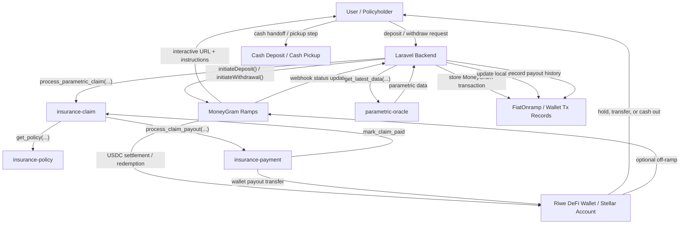
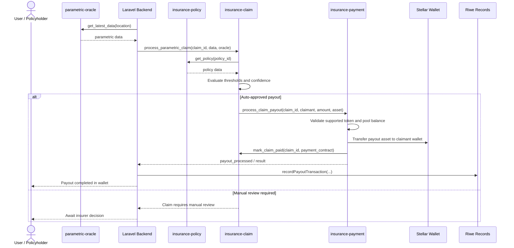

# DeFi Wallet System
## Multi-Network Custodial Wallet Implementation

---

## Table of Contents

1. [System Overview](#system-overview)
2. [Multi-Network Architecture](#multi-network-architecture)
3. [Custodial Address Management](#custodial-address-management)
4. [Fiat On/Off-Ramps](#fiat-on-off-ramps)
   - [MoneyGram capability summary](#moneygram-capability-summary)
   - [Configuration surface](#configuration-surface)
   - [Deposit and withdrawal flows](#deposit-flow-cash-in-to-stellar-wallet)
   - [Status lifecycle and webhooks](#status-lifecycle-and-webhooks)
   - [Additional route groups](#additional-route-groups)
5. [Claims Payout Flow](#claims-payout-flow)
6. [Security & Compliance](#security-compliance)
7. [API Integration](#api-integration)

**Related docs:** [04-Soroban-Overview.md](./04-Soroban-Overview.md) · [05-Contract-Specifications.md](./05-Contract-Specifications.md)

---

<a id="system-overview"></a>
## System Overview

This wallet documentation covers wallet operations, fiat rails, and payout settlement around the same **live 4-contract Soroban insurance suite** described in `docs/04-Soroban-Overview.md` and `docs/05-Contract-Specifications.md`.

### DeFi Wallet Purpose
The DeFi Wallet system provides users with a comprehensive multi-network cryptocurrency wallet that seamlessly integrates with traditional financial systems through fiat on/off-ramps, while also acting as the primary settlement account for insurance premiums and claims payouts on Stellar.

### Key Features
- **Multi-Network Support**: Stellar, Bitcoin, Ethereum, Polygon, BSC, Tron
- **Custodial Management**: Secure, deterministic address generation
- **Fiat Integration**: NGN ↔ Crypto conversion via Paystack plus USDC cash ramps via MoneyGram
- **Real-Time Balances**: Live balance synchronization across networks
- **KYC/AML Compliance**: Built-in regulatory compliance
- **Insurance Integration**: Direct connection to parametric insurance, claim settlement, and payout delivery into Stellar wallets

### Architecture Overview
```
┌─────────────────────────────────────────────────────────────────┐
│                    DeFi Wallet System                          │
├─────────────────────────────────────────────────────────────────┤
│                                                                 │
│  ┌─────────────┐  ┌─────────────┐  ┌─────────────┐             │
│  │   Wallet    │  │   Address   │  │   Balance   │             │
│  │ Management  │  │ Generation  │  │    Sync     │             │
│  │             │  │             │  │             │             │
│  │ • Create    │  │ • Multi-Net │  │ • Real-Time │             │
│  │ • Enable    │  │ • Custodial │  │ • Multi-Curr│             │
│  │ • Disable   │  │ • Secure    │  │ • Caching   │             │
│  └─────────────┘  └─────────────┘  └─────────────┘             │
│         │                 │                 │                  │
│         └─────────────────┼─────────────────┘                  │
│                           │                                    │
│  ┌─────────────────────────────────────────────────────────────┤
│  │                Fiat On/Off-Ramp System                     │
│  │                                                             │
│  │ • Paystack Integration    • MoneyGram Cash Ramps           │
│  │ • Exchange Rate Mgmt      • Bank / Cash Pickup Options     │
│  │ • Transaction Processing  • KYC/AML Compliance             │
│  └─────────────────────────────────────────────────────────────┘
│                           │                                    │
│  ┌─────────────────────────────────────────────────────────────┤
│  │              Multi-Network Integration                      │
│  │                                                             │
│  │ • Stellar (XLM)          • Ethereum (ETH)                  │
│  │ • Bitcoin (BTC)          • Polygon (MATIC)                 │
│  │ • Binance SC (BNB)       • Tron (TRX)                      │
│  └─────────────────────────────────────────────────────────────┘
└─────────────────────────────────────────────────────────────────┘
```

---

<a id="multi-network-architecture"></a>
## Multi-Network Architecture

### Supported Networks

#### Primary Networks
```php
// config/defi-tokens.php
'networks' => [
    'stellar' => [
        'name' => 'Stellar',
        'symbol' => 'XLM',
        'native_token' => 'XLM',
        'decimals' => 7,
        'rpc_url' => 'https://horizon.stellar.org',
        'explorer_url' => 'https://stellar.expert/explorer/public',
        'tokens' => ['XLM', 'USDC']
    ],
    'bitcoin' => [
        'name' => 'Bitcoin',
        'symbol' => 'BTC',
        'native_token' => 'BTC',
        'decimals' => 8,
        'explorer_url' => 'https://blockstream.info',
        'tokens' => ['BTC']
    ],
    'ethereum' => [
        'name' => 'Ethereum',
        'symbol' => 'ETH',
        'native_token' => 'ETH',
        'decimals' => 18,
        'rpc_url' => 'https://mainnet.infura.io/v3/{PROJECT_ID}',
        'explorer_url' => 'https://etherscan.io',
        'tokens' => ['ETH', 'USDT', 'USDC', 'WETH']
    ],
    'polygon' => [
        'name' => 'Polygon',
        'symbol' => 'MATIC',
        'native_token' => 'MATIC',
        'decimals' => 18,
        'rpc_url' => 'https://polygon-mainnet.infura.io/v3/{PROJECT_ID}',
        'explorer_url' => 'https://polygonscan.com',
        'tokens' => ['MATIC', 'USDT', 'USDC', 'WETH']
    ],
    'bsc' => [
        'name' => 'Binance Smart Chain',
        'symbol' => 'BNB',
        'native_token' => 'BNB',
        'decimals' => 18,
        'rpc_url' => 'https://bsc-dataseed1.binance.org',
        'explorer_url' => 'https://bscscan.com',
        'tokens' => ['BNB', 'USDT', 'USDC', 'BUSD']
    ],
    'tron' => [
        'name' => 'Tron',
        'symbol' => 'TRX',
        'native_token' => 'TRX',
        'decimals' => 6,
        'rpc_url' => 'https://api.trongrid.io',
        'explorer_url' => 'https://tronscan.org',
        'tokens' => ['TRX', 'USDT', 'USDC']
    ]
]
```

### Database Schema
```sql
-- defi_wallets table
CREATE TABLE defi_wallets (
    id BIGINT PRIMARY KEY AUTO_INCREMENT,
    user_id BIGINT NOT NULL,
    stellar_wallet_id BIGINT NULL,
    status ENUM('inactive', 'active', 'suspended', 'closed') DEFAULT 'inactive',
    is_enabled BOOLEAN DEFAULT FALSE,
    enabled_at TIMESTAMP NULL,
    
    -- Balance tracking
    balance_usd DECIMAL(20,8) DEFAULT 0,
    balance_ngn DECIMAL(20,2) DEFAULT 0,
    balance_xlm DECIMAL(20,7) DEFAULT 0,
    custom_asset_balances JSON NULL,
    
    -- Network addresses
    stellar_address VARCHAR(56) NULL,
    bitcoin_address VARCHAR(62) NULL,
    ethereum_address VARCHAR(42) NULL,
    polygon_address VARCHAR(42) NULL,
    bsc_address VARCHAR(42) NULL,
    tron_address VARCHAR(34) NULL,
    
    -- Testnet addresses
    bitcoin_testnet_address VARCHAR(62) NULL,
    ethereum_testnet_address VARCHAR(42) NULL,
    polygon_testnet_address VARCHAR(42) NULL,
    bsc_testnet_address VARCHAR(42) NULL,
    tron_testnet_address VARCHAR(34) NULL,
    
    -- Configuration
    fiat_enabled BOOLEAN DEFAULT TRUE,
    preferred_fiat_currency VARCHAR(3) DEFAULT 'NGN',
    daily_limit_fiat DECIMAL(15,2) DEFAULT 1000000,
    monthly_limit_fiat DECIMAL(15,2) DEFAULT 10000000,
    
    -- KYC and compliance
    kyc_level ENUM('none', 'basic', 'enhanced') DEFAULT 'none',
    requires_kyc_for_fiat BOOLEAN DEFAULT TRUE,
    kyc_limit_threshold DECIMAL(15,2) DEFAULT 50000,
    
    -- Security
    two_factor_required BOOLEAN DEFAULT FALSE,
    transaction_notifications BOOLEAN DEFAULT TRUE,
    security_preferences JSON NULL,
    
    -- Metadata
    address_metadata JSON NULL,
    addresses_generated_at TIMESTAMP NULL,
    last_balance_sync TIMESTAMP NULL,
    
    -- Timestamps
    created_at TIMESTAMP DEFAULT CURRENT_TIMESTAMP,
    updated_at TIMESTAMP DEFAULT CURRENT_TIMESTAMP ON UPDATE CURRENT_TIMESTAMP,
    deleted_at TIMESTAMP NULL,
    
    -- Indexes
    INDEX idx_user_id (user_id),
    INDEX idx_status (status),
    INDEX idx_enabled (is_enabled),
    FOREIGN KEY (user_id) REFERENCES users(id),
    FOREIGN KEY (stellar_wallet_id) REFERENCES stellar_wallets(id)
);
```

---

<a id="custodial-address-management"></a>
## Custodial Address Management

### CustodialAddressService
```php
class CustodialAddressService
{
    /**
     * Generate addresses for all supported networks
     */
    public function generateAddressesForWallet(DefiWallet $wallet): array
    {
        $addresses = [];
        $supportedNetworks = $this->getSupportedNetworks();
        
        foreach ($supportedNetworks as $network => $config) {
            try {
                // Generate mainnet address
                $address = $this->generateAddressForNetwork(
                    $wallet,
                    $network,
                    false // mainnet
                );
                
                if ($address) {
                    $addresses[$network . '_address'] = $address;
                }
                
                // Generate testnet address if supported
                if (isset($config['testnet_supported']) && $config['testnet_supported']) {
                    $testnetAddress = $this->generateAddressForNetwork(
                        $wallet,
                        $network,
                        true // testnet
                    );
                    
                    if ($testnetAddress) {
                        $addresses[$network . '_testnet_address'] = $testnetAddress;
                    }
                }
                
            } catch (Exception $e) {
                Log::error("Failed to generate {$network} address", [
                    'wallet_id' => $wallet->id,
                    'network' => $network,
                    'error' => $e->getMessage()
                ]);
            }
        }
        
        return $addresses;
    }

    /**
     * Generate deterministic address for specific network
     */
    protected function generateAddressForNetwork(
        DefiWallet $wallet,
        string $network,
        bool $testnet = false
    ): ?string {
        // Create deterministic seed
        $seed = $this->createDeterministicSeed(
            $wallet->user_id,
            $wallet->user->email,
            $wallet->id,
            $network,
            $testnet ? 'testnet' : 'mainnet'
        );
        
        switch ($network) {
            case 'stellar':
                return $this->generateStellarAddress($seed);
            case 'bitcoin':
                return $this->generateBitcoinAddress($seed, $testnet);
            case 'ethereum':
            case 'polygon':
            case 'bsc':
                return $this->generateEthereumAddress($seed);
            case 'tron':
                return $this->generateTronAddress($seed);
            default:
                throw new Exception("Unsupported network: {$network}");
        }
    }

    /**
     * Create deterministic seed for address generation
     */
    protected function createDeterministicSeed(
        int $userId,
        string $email,
        int $walletId,
        string $network,
        string $networkType
    ): string {
        $appKey = config('app.key');
        $version = 'v1';
        
        $data = implode('|', [
            $appKey,
            $userId,
            $email,
            $walletId,
            $network,
            $networkType,
            $version
        ]);
        
        return hash('sha256', $data);
    }

    /**
     * Generate Stellar address
     */
    protected function generateStellarAddress(string $seed): string
    {
        // Use seed to generate Stellar keypair
        $keypair = KeyPair::fromSeed($seed);
        return $keypair->getAccountId();
    }

    /**
     * Generate Bitcoin address
     */
    protected function generateBitcoinAddress(string $seed, bool $testnet): string
    {
        // Generate Bitcoin address using seed
        // Implementation depends on Bitcoin library
        $prefix = $testnet ? 'tb1q' : 'bc1q';
        $hash = substr(hash('sha256', $seed . 'bitcoin'), 0, 40);
        return $prefix . $hash;
    }

    /**
     * Generate Ethereum-compatible address
     */
    protected function generateEthereumAddress(string $seed): string
    {
        // Generate Ethereum address using seed
        $hash = hash('sha256', $seed . 'ethereum');
        return '0x' . substr($hash, 0, 40);
    }

    /**
     * Generate Tron address
     */
    protected function generateTronAddress(string $seed): string
    {
        // Generate Tron address using seed
        $hash = hash('sha256', $seed . 'tron');
        return 'T' . substr($hash, 0, 33);
    }

    /**
     * Validate address format for network
     */
    public function validateAddressFormat(string $address, string $network): bool
    {
        switch ($network) {
            case 'stellar':
                return preg_match('/^G[A-Z2-7]{55}$/', $address);
            case 'bitcoin':
                return preg_match('/^(bc1q|tb1q)[a-z0-9]{39}$/', $address);
            case 'ethereum':
            case 'polygon':
            case 'bsc':
                return preg_match('/^0x[a-fA-F0-9]{40}$/', $address);
            case 'tron':
                return preg_match('/^T[A-Za-z0-9]{33}$/', $address);
            default:
                return false;
        }
    }
}
```

### DefiWallet Model Extensions
```php
class DefiWallet extends Model
{
    /**
     * Get all wallet addresses
     */
    public function getAllAddresses(bool $includeTestnet = false): array
    {
        $addresses = [];
        $networks = config('defi-tokens.networks');
        
        foreach ($networks as $network => $config) {
            $addressField = $network . '_address';
            if ($this->$addressField) {
                $addresses[] = [
                    'network' => $network,
                    'network_name' => $config['name'],
                    'symbol' => $config['symbol'],
                    'address' => $this->$addressField,
                    'is_testnet' => false,
                    'is_primary' => $network === 'stellar'
                ];
            }
            
            if ($includeTestnet) {
                $testnetField = $network . '_testnet_address';
                if ($this->$testnetField) {
                    $addresses[] = [
                        'network' => $network,
                        'network_name' => $config['name'] . ' Testnet',
                        'symbol' => $config['symbol'],
                        'address' => $this->$testnetField,
                        'is_testnet' => true,
                        'is_primary' => false
                    ];
                }
            }
        }
        
        return $addresses;
    }

    /**
     * Get address for specific network
     */
    public function getAddressForNetwork(string $network, bool $testnet = false): ?string
    {
        $field = $network . ($testnet ? '_testnet' : '') . '_address';
        return $this->$field;
    }

    /**
     * Update wallet addresses
     */
    public function updateAddresses(array $addresses): void
    {
        $this->update(array_merge($addresses, [
            'addresses_generated_at' => now()
        ]));
    }

    /**
     * Get primary address (Stellar)
     */
    public function getPrimaryAddress(): ?string
    {
        return $this->stellar_address;
    }

    /**
     * Check if wallet has addresses
     */
    public function hasAddresses(): bool
    {
        return !empty($this->stellar_address);
    }
}
```

---

<a id="fiat-on-off-ramps"></a>
## Fiat On/Off-Ramps

### On-Ramp Process Flow
```
User Request → KYC Check → Rate Quote → Payment Init → 
Fiat Collection → Crypto Purchase → Wallet Delivery → Confirmation
```

### DefiWalletService - Deposit Implementation
```php
/**
 * Initiate fiat deposit (on-ramp)
 */
public function initiateDeposit(DefiWallet $wallet, array $depositData): array
{
    try {
        DB::beginTransaction();

        // Validate KYC status
        if (!$this->validateKYCStatus($wallet->user)) {
            throw new Exception('KYC verification required for fiat deposits');
        }

        // Get real-time exchange rate
        $exchangeRate = $this->getExchangeRate('NGN', 'XLM');
        $cryptoAmount = $depositData['amount'] / $exchangeRate;
        
        // Calculate fees
        $providerFee = $this->calculateProviderFee($depositData['amount']);
        $platformFee = $this->calculatePlatformFee($depositData['amount']);
        $totalFees = $providerFee + $platformFee;
        
        // Create transaction record
        $transaction = DefiTransaction::create([
            'user_id' => $wallet->user_id,
            'defi_wallet_id' => $wallet->id,
            'type' => 'deposit_fiat',
            'status' => 'pending',
            'amount' => $depositData['amount'],
            'currency' => 'NGN',
            'amount_usd' => $depositData['amount'] / 800, // NGN to USD
            'crypto_amount' => $cryptoAmount,
            'crypto_currency' => 'XLM',
            'exchange_rate' => $exchangeRate,
            'provider_fee' => $providerFee,
            'platform_fee' => $platformFee,
            'total_fees' => $totalFees,
            'reference' => 'DEP-' . time() . '-' . rand(1000, 9999),
            'expires_at' => now()->addHours(1),
        ]);

        // Create fiat onramp record
        $onramp = FiatOnramp::create([
            'user_id' => $wallet->user_id,
            'defi_wallet_id' => $wallet->id,
            'defi_transaction_id' => $transaction->id,
            'provider' => 'paystack',
            'type' => 'deposit',
            'status' => 'initiated',
            'fiat_amount' => $depositData['amount'],
            'fiat_currency' => 'NGN',
            'crypto_amount' => $cryptoAmount,
            'crypto_currency' => 'XLM',
            'exchange_rate' => $exchangeRate,
            'provider_fee' => $providerFee,
            'platform_fee' => $platformFee,
            'expires_at' => now()->addHours(1),
        ]);

        // Initialize Paystack payment
        $paymentResult = $this->paystackService->initializePayment([
            'email' => $wallet->user->email,
            'amount' => $depositData['amount'] * 100, // Convert to kobo
            'reference' => $transaction->reference,
            'callback_url' => config('app.url') . '/defi-wallet/deposit/verify',
            'metadata' => [
                'transaction_id' => $transaction->id,
                'onramp_id' => $onramp->id,
                'wallet_id' => $wallet->id,
                'type' => 'defi_deposit'
            ]
        ]);

        if (!$paymentResult['success']) {
            throw new Exception('Failed to initialize payment with Paystack');
        }

        // Update onramp with payment details
        $onramp->update([
            'provider_reference' => $paymentResult['data']['reference'],
            'paystack_authorization_url' => $paymentResult['data']['authorization_url'],
            'paystack_access_code' => $paymentResult['data']['access_code'],
            'provider_response' => $paymentResult['data'],
        ]);

        DB::commit();

        return [
            'success' => true,
            'transaction_id' => $transaction->id,
            'onramp_id' => $onramp->id,
            'payment_url' => $paymentResult['data']['authorization_url'],
            'amount' => $depositData['amount'],
            'crypto_amount' => $cryptoAmount,
            'exchange_rate' => $exchangeRate,
            'fees' => [
                'provider_fee' => $providerFee,
                'platform_fee' => $platformFee,
                'total_fees' => $totalFees,
            ],
            'expires_at' => $onramp->expires_at,
        ];

    } catch (Exception $e) {
        DB::rollBack();
        Log::error('Deposit initiation failed', [
            'wallet_id' => $wallet->id,
            'error' => $e->getMessage(),
            'data' => $depositData
        ]);

        return [
            'success' => false,
            'message' => $e->getMessage()
        ];
    }
}
```

### Off-Ramp Process Flow
```
Withdrawal Request → Bank Verification → Rate Quote → Crypto Collection → 
Fiat Conversion → Bank Transfer → Confirmation
```

### Withdrawal Implementation
```php
/**
 * Initiate fiat withdrawal (off-ramp)
 */
public function initiateWithdrawal(DefiWallet $wallet, array $withdrawalData): array
{
    try {
        DB::beginTransaction();

        // Validate withdrawal amount and balance
        $requiredCrypto = $withdrawalData['amount'] / $this->getExchangeRate('XLM', 'NGN');
        $walletBalance = $this->getWalletBalance($wallet);
        
        if ($walletBalance['xlm'] < $requiredCrypto) {
            throw new Exception('Insufficient wallet balance');
        }

        // Verify bank account
        $bankVerification = $this->paystackBankService->verifyBankAccount(
            $withdrawalData['account_number'],
            $withdrawalData['bank_code']
        );

        if (!$bankVerification['success']) {
            throw new Exception('Bank account verification failed: ' . $bankVerification['message']);
        }

        // Create withdrawal transaction
        $transaction = DefiTransaction::create([
            'user_id' => $wallet->user_id,
            'defi_wallet_id' => $wallet->id,
            'type' => 'withdraw_fiat',
            'status' => 'pending',
            'amount' => $withdrawalData['amount'],
            'currency' => 'NGN',
            'crypto_amount' => $requiredCrypto,
            'crypto_currency' => 'XLM',
            'exchange_rate' => $this->getExchangeRate('XLM', 'NGN'),
            'reference' => 'WTH-' . time() . '-' . rand(1000, 9999),
        ]);

        // Create fiat onramp record for withdrawal
        $onramp = FiatOnramp::create([
            'user_id' => $wallet->user_id,
            'defi_wallet_id' => $wallet->id,
            'defi_transaction_id' => $transaction->id,
            'provider' => 'paystack',
            'type' => 'withdrawal',
            'status' => 'initiated',
            'fiat_amount' => $withdrawalData['amount'],
            'fiat_currency' => 'NGN',
            'crypto_amount' => $requiredCrypto,
            'crypto_currency' => 'XLM',
            'exchange_rate' => $this->getExchangeRate('XLM', 'NGN'),
            'bank_name' => $this->paystackBankService->getBankNameByCode($withdrawalData['bank_code']),
            'bank_code' => $withdrawalData['bank_code'],
            'account_number' => $withdrawalData['account_number'],
            'account_name' => $bankVerification['data']['account_name'],
            'account_verified' => true,
            'account_verified_at' => now(),
        ]);

        // Create Paystack transfer recipient
        $recipientResult = $this->paystackService->createTransferRecipient([
            'type' => 'nuban',
            'name' => $bankVerification['data']['account_name'],
            'account_number' => $withdrawalData['account_number'],
            'bank_code' => $withdrawalData['bank_code'],
            'currency' => 'NGN'
        ]);

        if (!$recipientResult['success']) {
            throw new Exception('Failed to create transfer recipient');
        }

        $onramp->update([
            'paystack_recipient_code' => $recipientResult['data']['recipient_code']
        ]);

        DB::commit();

        return [
            'success' => true,
            'transaction_id' => $transaction->id,
            'onramp_id' => $onramp->id,
            'amount' => $withdrawalData['amount'],
            'crypto_amount' => $requiredCrypto,
            'account_name' => $bankVerification['data']['account_name'],
            'processing_time' => '1-3 business days'
        ];

    } catch (Exception $e) {
        DB::rollBack();
        Log::error('Withdrawal initiation failed', [
            'wallet_id' => $wallet->id,
            'error' => $e->getMessage(),
            'data' => $withdrawalData
        ]);

        return [
            'success' => false,
            'message' => $e->getMessage()
        ];
    }
}
```

### MoneyGram USDC Cash Ramps

In addition to the Paystack NGN bank-transfer flow, the wallet system supports **MoneyGram on/off-ramp integration** for **USDC on Stellar**. This gives the wallet a second fiat corridor focused on cash deposit and cash pickup, especially useful for users operating outside the standard bank-transfer path.

**MoneyGram quick navigation:**
- [Capability summary](#moneygram-capability-summary)
- [Configuration surface](#configuration-surface)
- [Service methods](#moneygram-service-methods)
- [Deposit flow](#deposit-flow-cash-in-to-stellar-wallet)
- [Withdrawal flow](#withdrawal-flow-cash-out-from-stellar-wallet)
- [Status lifecycle and webhooks](#status-lifecycle-and-webhooks)
- [Additional route groups](#additional-route-groups)

#### Integration Model

| Component | Role in the wallet flow |
| --- | --- |
| `docs/MONEYGRAM_INTEGRATION.md` | Detailed operational and configuration reference |
| `app/Services/MoneyGramRampsService.php` | Implements SEP-24 style deposit and withdrawal initiation |
| `app/Http/Controllers/MoneyGramController.php` | Validates requests, checks wallet prerequisites, and returns interactive session data |
| `routes/moneygram.php` | Exposes public info/webhook routes plus authenticated deposit, withdrawal, and transaction routes |
| `routes/moneygram-api.php` | Test-suite endpoints for MoneyGram approval and sandbox support |

<a id="moneygram-capability-summary"></a>
#### MoneyGram Capability Summary

| Capability | Current behavior in Riwe |
| --- | --- |
| Asset rail | USDC on Stellar |
| Ramp model | SEP-24 style interactive deposit and withdrawal |
| Auth model | Wallet/app auth for Riwe routes, SEP-compatible integration on the provider side |
| User experience | Interactive URL + instructions returned to frontend |
| Settlement destination | User's Stellar account / wallet |
| Provider recordkeeping | Stored locally in `FiatOnramp` with provider `moneygram` |
| Status updates | Webhook + status lookup + local status mapping |
| Test mode | Sandbox flow with mock interactive session support |

#### Wallet & User Prerequisites

- The user must already have a **Stellar wallet** or wallet-plus record before using MoneyGram routes.
- The integration settles against the user's Stellar account, so the wallet remains the destination/source of truth.
- KYC/AML checks still apply because these are fiat and cash-handling operations.
- The integration is environment-driven, with sandbox support for testing and production-ready configuration through `config/services.php`.

If a user has neither `stellarWallet` nor `walletPlus`, `MoneyGramController` returns: `Wallet required. Please set up your wallet first.`

<a id="configuration-surface"></a>
#### Configuration Surface

The integration is configured through environment and service configuration, including:

- `MONEYGRAM_ENVIRONMENT`
- `MONEYGRAM_BASE_URL`
- `MONEYGRAM_HOME_DOMAIN`
- `MONEYGRAM_SIGNING_KEY`
- `services.moneygram.limits.on_ramp`
- `services.moneygram.limits.off_ramp`
- `services.moneygram.supported_currencies`
- `services.moneygram.usdc.testnet.asset_issuer`
- `services.moneygram.usdc.mainnet.asset_issuer`

This allows the same wallet experience to operate in sandbox or production-style mode while switching the correct USDC issuer for testnet versus mainnet.

<a id="moneygram-service-methods"></a>
#### MoneyGram Service Methods

The core integration is implemented in `MoneyGramRampsService`:

- `initiateDeposit(User $user, float $amount, string $currency = 'USD'): array`
- `initiateWithdrawal(User $user, float $amount, string $currency = 'USD'): array`
- `getTransactionStatus(string $moneygramTransactionId): array`
- `handleWebhook(array $payload): bool`

Both methods validate amount limits, create MoneyGram-linked transaction records, and return an **interactive URL** plus user instructions for the next step in the SEP-24 flow.

The service also sends `on_change_callback => route('moneygram.webhook')`, so provider-side status changes can flow back into Riwe's local transaction state.

<a id="deposit-flow-cash-in-to-stellar-wallet"></a>
#### Deposit Flow (Cash-In to Stellar Wallet)

```text
User -> /moneygram/deposit -> MoneyGramController::initiateDeposit()
-> MoneyGramRampsService::initiateDeposit()
-> MoneyGram interactive session / instructions
-> User completes cash deposit with MoneyGram
-> USDC settles into the user's Stellar wallet
```

<a id="withdrawal-flow-cash-out-from-stellar-wallet"></a>
#### Withdrawal Flow (Cash-Out from Stellar Wallet)

```text
User -> /moneygram/withdrawal -> MoneyGramController::initiateWithdrawal()
-> MoneyGramRampsService::initiateWithdrawal()
-> MoneyGram interactive session / instructions
-> User presents ID and reference at agent location
-> Cash is collected while wallet-side transaction state is tracked in Riwe
```

#### Supported Currencies and Corridor Scope

The broader MoneyGram configuration currently includes support for:

- `USD`, `EUR`, `GBP`, `CAD`, `AUD`
- `NGN`, `KES`, `GHS`, `ZAR`
- `MXN`, `BRL`, `INR`
- `PHP`, `THB`, `VND`, `IDR`, `MYR`, `SGD`

At the controller validation layer, the main user-facing withdrawal flow currently enforces a narrower subset of supported currencies for operational safety.

#### Limits and Asset Model

- **Settlement asset**: USDC on Stellar
- **Deposit limits**: minimum **$5**, maximum **$950**
- **Withdrawal limits**: minimum **$5**, maximum **$2,500**
- **Typical processing window**: around **5–15 minutes** depending on corridor and session status
- **Provider tracking**: transactions are recorded with provider `moneygram` and linked through `FiatOnramp`

Both `validateDepositAmount(...)` and `validateWithdrawalAmount(...)` enforce these limits before a MoneyGram session is created.

#### Transaction Tracking and Local Persistence

For both deposit and withdrawal, Riwe creates a local `FiatOnramp` record with MoneyGram-specific metadata. Important stored fields include:

- `provider = moneygram`
- `provider_reference`
- `provider_transaction_id`
- `type = deposit | withdrawal`
- `status = initiated`
- `crypto_currency = USDC`
- metadata containing the raw MoneyGram response and the linked Stellar account

This gives the wallet system an internal audit trail even before the external MoneyGram flow is complete.

<a id="status-lifecycle-and-webhooks"></a>
#### Status Lifecycle and Webhooks

MoneyGram session state is tracked through both explicit lookups and webhook-driven updates.

Typical provider or locally surfaced states include:

| Provider / local signal | Meaning in the wallet flow |
| --- | --- |
| `pending_user_transfer_start` | User still needs to begin the deposit or withdrawal action |
| `pending_anchor` / `pending_stellar` / `pending_external` | Processing is underway across provider or settlement infrastructure |
| `pending_trust` / `pending_user` | Waiting on user-side or account-side preconditions |
| `completed` | MoneyGram transaction completed successfully |
| `error` / `incomplete` | Flow failed or did not complete |
| `pending_pickup` | Internal/test-oriented state representing cash awaiting collection |

The controller maps provider statuses into local application statuses such as `pending`, `processing`, `completed`, and `failed`.

Webhook processing is exposed at `POST /moneygram/webhook`, and the service updates local transaction metadata with the incoming webhook payload and timestamp.

#### Sandbox vs Production Behavior

- In **sandbox**, the service returns a mock MoneyGram ID, a Riwe-hosted sandbox route, and plain-language instructions for testing the flow.
- In **non-sandbox environments**, the service posts directly to the MoneyGram interactive transaction endpoints.
- This means the frontend can keep a mostly consistent user experience while the backend switches between simulated and live provider behavior.

#### Primary MoneyGram Endpoints

- `GET /moneygram/info`
- `GET /moneygram/options`
- `POST /moneygram/deposit`
- `POST /moneygram/withdrawal`
- `GET /moneygram/transactions`
- `GET /moneygram/transactions/{id}`
- `POST /moneygram/webhook`
- API equivalents are also exposed under `/api/moneygram`

<a id="additional-route-groups"></a>
#### Additional Route Groups

Beyond the core user-facing endpoints above, the integration also exposes:

- `/moneygram` for the authenticated web UI entry point
- `/api/moneygram/*` for Sanctum-protected frontend or mobile integration
- `/api/sep/interactive/*` for SEP-style interactive compatibility documented in the dedicated MoneyGram integration reference

#### MoneyGram + Claims Payout Architecture Flow Diagram



---

<a id="claims-payout-flow"></a>
## Claims Payout Flow

The DeFi wallet is not only a funding account for deposits and withdrawals; it is also the **settlement layer for insurance payouts**. When a claim is approved or automatically triggered, the payout ultimately lands in the user's Stellar wallet, where it can be retained, spent, or off-ramped.

This section follows the same live 4-contract Soroban architecture described in `docs/04-Soroban-Overview.md` and `docs/05-Contract-Specifications.md`: `insurance-policy`, `insurance-claim`, `insurance-payment`, and `parametric-oracle`.

### Why the Wallet Matters for Claims

- The user's **Stellar wallet** is the primary destination for insurance payouts.
- Payout history can be recorded as wallet-linked `StellarTransaction` records.
- After settlement, the user can keep value on-chain or move it into a fiat/cash corridor such as MoneyGram.

### On-Chain Contract Payout Architecture

The live Soroban insurance suite uses the same four-contract structure documented elsewhere in the repo:

| Contract / Service | Key function | Wallet relevance |
| --- | --- | --- |
| `insurance-policy` | policy lookup and policy-state source of truth | supplies policy context used during claim evaluation and payout calculation |
| `parametric-oracle` | retained oracle data queried by the backend/operator | provides the external conditions used before claim processing is invoked |
| `insurance-claim` | `process_parametric_claim(...)` | Evaluates oracle-backed claim conditions and decides whether payout should proceed |
| `insurance-claim` | invokes `process_claim_payout(...)` | Hands settlement over to the payment contract |
| `insurance-payment` | `process_claim_payout(env, claim_id, recipient, amount, asset)` | Validates asset, transfers payout, stores payment data, and marks claim as paid |
| `StellarClaimService` | `processAutomaticPayout(...)` | Application-layer orchestration for automatic payout handling |
| `StellarClaimService` | `sendPayoutToUser(...)` | Sends the payout into the user's Stellar wallet |
| `StellarClaimService` | `recordPayoutTransaction(...)` | Records the payout in wallet-linked transaction history |
| `StellarSmartContractService` | `processParametricPayout(...)` | Backend integration point for claim-payout smart-contract invocation |

Within `insurance-payment`, `process_claim_payout(...)` checks that the payout asset is supported, transfers funds from the insurance pool to the claimant, stores the payment, and then calls `mark_claim_paid` back on the claim contract.

### Automatic Parametric Payout Path

For parametric insurance, the wallet payout lifecycle is:

1. Authorized oracle data is captured and retained in `parametric-oracle`.
2. The backend/operator supplies relevant data to `insurance-claim::process_parametric_claim(...)`.
3. If thresholds are met and confidence is high enough, the claim contract triggers `insurance-payment::process_claim_payout(...)`.
4. In the application layer, `StellarClaimService::processAutomaticPayout(...)` calculates the payout amount, calls `StellarSmartContractService::processParametricPayout(...)`, sends payout funds to the user's Stellar wallet, and records the payout transaction.
5. The user then sees the payout as wallet-settled value that can be held or cashed out.

### Claims Payout Sequence Diagram



### Manual / Approved Claim Path

Not all claims are auto-approved. In the manual path:

1. An insurer reviews the claim.
2. `InsurerController` updates claim status and, for approved claims, creates a `Payout` record.
3. Settlement can then be executed through the wallet payout rail, with the Stellar wallet remaining the primary destination account.
4. Once credited, the user may retain the funds in-wallet or route them to an off-ramp/cash-out option.

### Wallet Settlement and Cash-Out Options

Once a claim payout reaches the Stellar wallet, the user can:

- keep the payout on Stellar for savings or later use;
- use it as a balance source for future insurance-related or wallet-native operations;
- cash out through supported off-ramp mechanisms, including the MoneyGram USDC corridor where applicable.

### Operational Runbook: Payout to Cash-Out

Use this lightweight operational flow when a claim payout is expected to end in a MoneyGram cash-out:

1. **Confirm claim state**
   - Verify the claim is approved or auto-approved.
   - Confirm the payout path has completed through `insurance-payment::process_claim_payout(...)` and the claim has been marked paid.
2. **Confirm wallet settlement**
   - Verify the user's Stellar wallet has received the payout.
   - Ensure the wallet balance intended for cash-out is held in the supported MoneyGram corridor asset, currently **USDC on Stellar**.
3. **Validate operational prerequisites**
   - Confirm the user has an active wallet record.
   - Confirm KYC/compliance checks are satisfied.
   - Confirm the requested withdrawal amount is within MoneyGram limits (**$5-$2,500**).
4. **Initiate MoneyGram withdrawal**
   - Use the authenticated withdrawal route: `POST /moneygram/withdrawal`.
   - Return the interactive URL, provider reference, and instructions to the user.
5. **Track status to completion**
   - Monitor local `FiatOnramp` status, provider reference, and webhook updates.
   - Treat `pending_user_transfer_start`, `pending`, `processing`, or `pending_pickup` as in-flight states.
6. **Handle exceptions early**
   - If there is no wallet, stop and resolve wallet setup first.
   - If the asset or corridor is unsupported, do not route to MoneyGram until the wallet balance is aligned with the supported off-ramp path.
   - If the transaction reaches `failed`, `error`, or `incomplete`, investigate the MoneyGram response payload before retrying.
7. **Close out and reconcile**
   - Mark the cash-out operationally complete only after the MoneyGram flow reaches a terminal success state.
   - Keep the wallet transaction record and MoneyGram-linked `FiatOnramp` entry for audit and support follow-up.

### Operational Notes

- A wallet-backed Stellar destination is required for smooth payout settlement.
- Automatic payout orchestration already exists in `StellarClaimService`, while the backend smart-contract integration points are aligned to the modular `insurance-claim` and `insurance-payment` contract design.
- The wallet therefore acts as the bridge between on-chain insurance events and real-world cash-out rails.

---

<a id="security-compliance"></a>
## Security & Compliance

### KYC/AML Integration
```php
/**
 * Validate user KYC status for fiat operations
 */
protected function validateKYCStatus(User $user): bool
{
    $kyc = $user->kyc;
    
    if (!$kyc) {
        return false;
    }
    
    // Basic KYC required for fiat operations
    return $kyc->status === 'verified' || $kyc->status === 'approved';
}

/**
 * Check transaction limits based on KYC level
 */
protected function checkTransactionLimits(DefiWallet $wallet, float $amount): bool
{
    $dailyLimit = $wallet->daily_limit_fiat;
    $monthlyLimit = $wallet->monthly_limit_fiat;
    
    // Check daily limit
    $dailyTotal = DefiTransaction::where('defi_wallet_id', $wallet->id)
        ->where('created_at', '>=', now()->startOfDay())
        ->where('status', '!=', 'failed')
        ->sum('amount');
    
    if ($dailyTotal + $amount > $dailyLimit) {
        return false;
    }
    
    // Check monthly limit
    $monthlyTotal = DefiTransaction::where('defi_wallet_id', $wallet->id)
        ->where('created_at', '>=', now()->startOfMonth())
        ->where('status', '!=', 'failed')
        ->sum('amount');
    
    if ($monthlyTotal + $amount > $monthlyLimit) {
        return false;
    }
    
    return true;
}
```

### Risk Assessment
```php
/**
 * Assess transaction risk
 */
protected function assessTransactionRisk(DefiWallet $wallet, array $transactionData): array
{
    $riskScore = 0;
    $riskFactors = [];
    
    // Amount-based risk
    if ($transactionData['amount'] > 100000) { // ₦100,000
        $riskScore += 20;
        $riskFactors[] = 'High transaction amount';
    }
    
    // Frequency-based risk
    $recentTransactions = DefiTransaction::where('defi_wallet_id', $wallet->id)
        ->where('created_at', '>=', now()->subDays(7))
        ->count();
    
    if ($recentTransactions > 5) {
        $riskScore += 15;
        $riskFactors[] = 'High transaction frequency';
    }
    
    // User verification status
    if (!$wallet->user->kyc || !$wallet->user->kyc->isVerified()) {
        $riskScore += 30;
        $riskFactors[] = 'Unverified user';
    }
    
    // Determine risk level
    $riskLevel = $riskScore >= 50 ? 'high' : ($riskScore >= 25 ? 'medium' : 'low');
    
    return [
        'risk_score' => $riskScore,
        'risk_level' => $riskLevel,
        'risk_factors' => $riskFactors,
        'requires_manual_review' => $riskLevel === 'high',
        'auto_approve' => $riskLevel === 'low' && $riskScore < 20,
    ];
}
```

---

<a id="api-integration"></a>
## API Integration

### REST API Endpoints
```php
// routes/api.php
Route::middleware(['auth:sanctum'])->group(function () {
    // Wallet management
    Route::get('/defi-wallet', [DefiWalletController::class, 'getWallet']);
    Route::post('/defi-wallet/create', [DefiWalletController::class, 'createWallet']);
    Route::post('/defi-wallet/enable', [DefiWalletController::class, 'enableWallet']);
    
    // Address management
    Route::get('/defi-wallet/addresses', [DefiWalletController::class, 'getAddresses']);
    Route::get('/defi-wallet/addresses/{network}', [DefiWalletController::class, 'getNetworkAddress']);
    
    // Fiat operations
    Route::post('/defi-wallet/deposit', [DefiWalletController::class, 'initiateDeposit']);
    Route::post('/defi-wallet/withdraw', [DefiWalletController::class, 'initiateWithdrawal']);
    
    // Transaction management
    Route::get('/defi-wallet/transactions', [DefiWalletController::class, 'getTransactions']);
    Route::get('/defi-wallet/transactions/{reference}', [DefiWalletController::class, 'getTransaction']);
    
    // Balance and sync
    Route::get('/defi-wallet/balance', [DefiWalletController::class, 'getBalance']);
    Route::post('/defi-wallet/sync', [DefiWalletController::class, 'syncBalance']);
});
```

### MoneyGram API Surface

The wallet system also exposes MoneyGram-specific routes alongside the generic `/defi-wallet/*` APIs:

- **Web/Auth routes** under `/moneygram`
- **API routes** under `/api/moneygram`
- **Webhook route** for status updates at `/moneygram/webhook`
- **Test-suite routes** under `/moneygram/api` for approval/sandbox support

These endpoints provide service info, supported options, deposit and withdrawal initiation, and transaction status lookups for the MoneyGram cash-ramp corridor.

### API Response Examples
```json
// GET /api/defi-wallet
{
  "success": true,
  "wallet": {
    "id": 123,
    "status": "active",
    "is_enabled": true,
    "balances": {
      "xlm": 100.0000000,
      "usd": 50.00000000,
      "ngn": 40000.00
    },
    "addresses": {
      "stellar": "G955E0C35EB6D013D35B4E704E8395FF9B94417D8E443E2AF5BF39F5",
      "bitcoin": "bc1q1a9a7a3149ea8b91c2059ca6ffe2995d80452ca7",
      "ethereum": "0x1a9a7a3149ea8b91c2059ca6ffe2995d80452ca7"
    },
    "limits": {
      "daily_limit": 1000000,
      "monthly_limit": 10000000,
      "kyc_threshold": 50000
    }
  }
}

// POST /api/defi-wallet/deposit
{
  "success": true,
  "transaction_id": 456,
  "payment_url": "https://checkout.paystack.com/abc123",
  "amount": 50000,
  "crypto_amount": 62.5,
  "exchange_rate": 800,
  "expires_at": "2025-08-07T11:30:00Z"
}
```

### Transaction Processing Engine
```php
/**
 * Process multi-network transaction
 */
public function processTransaction(DefiWallet $wallet, array $transactionData): array
{
    try {
        DB::beginTransaction();

        // Validate transaction parameters
        $validation = $this->validateTransaction($wallet, $transactionData);
        if (!$validation['valid']) {
            throw new Exception($validation['message']);
        }

        // Determine transaction type and network
        $network = $transactionData['network'];
        $transactionType = $transactionData['type']; // send, receive, swap

        // Create transaction record
        $transaction = DefiTransaction::create([
            'user_id' => $wallet->user_id,
            'defi_wallet_id' => $wallet->id,
            'type' => $transactionType,
            'network' => $network,
            'status' => 'pending',
            'amount' => $transactionData['amount'],
            'currency' => $transactionData['currency'],
            'from_address' => $transactionData['from_address'] ?? null,
            'to_address' => $transactionData['to_address'] ?? null,
            'transaction_hash' => null, // Will be set after network submission
            'network_fee' => $this->calculateNetworkFee($network, $transactionData),
            'platform_fee' => $this->calculatePlatformFee($transactionData['amount']),
            'reference' => 'TXN-' . time() . '-' . rand(1000, 9999),
            'metadata' => $transactionData['metadata'] ?? null,
        ]);

        // Process based on network
        $networkResult = $this->processNetworkTransaction($network, $transactionData, $transaction);

        if (!$networkResult['success']) {
            $transaction->update(['status' => 'failed', 'error_message' => $networkResult['error']]);
            throw new Exception($networkResult['error']);
        }

        // Update transaction with network response
        $transaction->update([
            'transaction_hash' => $networkResult['transaction_hash'],
            'network_confirmation' => $networkResult['confirmation'],
            'status' => 'confirmed',
        ]);

        // Update wallet balances
        $this->updateWalletBalances($wallet, $transactionData, $transaction);

        DB::commit();

        return [
            'success' => true,
            'transaction_id' => $transaction->id,
            'transaction_hash' => $networkResult['transaction_hash'],
            'network' => $network,
            'status' => 'confirmed',
        ];

    } catch (Exception $e) {
        DB::rollBack();
        Log::error('Transaction processing failed', [
            'wallet_id' => $wallet->id,
            'transaction_data' => $transactionData,
            'error' => $e->getMessage()
        ]);

        return [
            'success' => false,
            'message' => $e->getMessage()
        ];
    }
}

/**
 * Process transaction on specific network
 */
protected function processNetworkTransaction(string $network, array $transactionData, DefiTransaction $transaction): array
{
    switch ($network) {
        case 'stellar':
            return $this->processStellarTransaction($transactionData, $transaction);
        case 'bitcoin':
            return $this->processBitcoinTransaction($transactionData, $transaction);
        case 'ethereum':
        case 'polygon':
        case 'bsc':
            return $this->processEVMTransaction($network, $transactionData, $transaction);
        case 'tron':
            return $this->processTronTransaction($transactionData, $transaction);
        default:
            throw new Exception("Unsupported network: {$network}");
    }
}

/**
 * Real-time balance synchronization
 */
public function syncWalletBalances(DefiWallet $wallet): array
{
    try {
        $balances = [];
        $totalUSD = 0;
        $totalNGN = 0;

        // Get all wallet addresses
        $addresses = $wallet->getAllAddresses();

        foreach ($addresses as $addressInfo) {
            $network = $addressInfo['network'];
            $address = $addressInfo['address'];

            // Get balance for each network
            $networkBalance = $this->getNetworkBalance($network, $address);

            if ($networkBalance['success']) {
                $balances[$network] = $networkBalance['balances'];

                // Convert to USD and NGN
                foreach ($networkBalance['balances'] as $currency => $amount) {
                    $usdValue = $this->convertToUSD($currency, $amount);
                    $ngnValue = $this->convertToNGN($currency, $amount);

                    $totalUSD += $usdValue;
                    $totalNGN += $ngnValue;
                }
            }
        }

        // Update wallet balance records
        $wallet->update([
            'balance_usd' => $totalUSD,
            'balance_ngn' => $totalNGN,
            'custom_asset_balances' => json_encode($balances),
            'last_balance_sync' => now(),
        ]);

        return [
            'success' => true,
            'balances' => $balances,
            'total_usd' => $totalUSD,
            'total_ngn' => $totalNGN,
            'sync_time' => now(),
        ];

    } catch (Exception $e) {
        Log::error('Balance sync failed', [
            'wallet_id' => $wallet->id,
            'error' => $e->getMessage()
        ]);

        return [
            'success' => false,
            'error' => $e->getMessage()
        ];
    }
}
```

---

