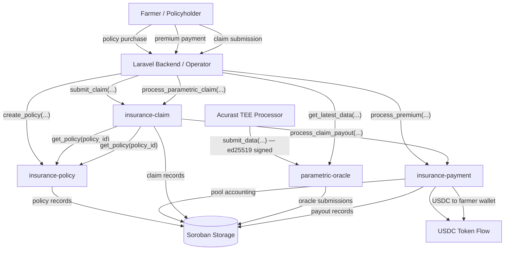
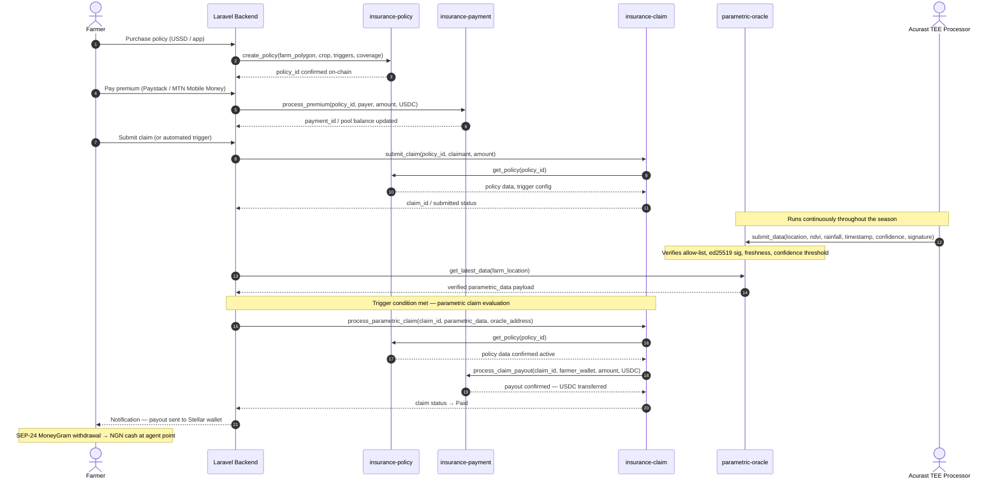

# Smart Contract Specifications
## Riwe Technologies — Parametric Climate Insurance on Stellar

**Related documentation:** [Soroban Smart Contracts Overview ←](./Soroban-Smart-Contracts-Overview.md) · [System Architecture ←](./System-Architecture.md) · [DeFi Wallet and MoneyGram Claims Payout](./DeFi-and-Moneygram-Claims-Payout.md)

---

## Table of Contents

1. [Overview](#overview)
2. [Architecture and Contract Relationships](#architecture-and-contract-relationships)
3. [Cross-Contract Call Sequence](#cross-contract-call-sequence)
4. [Contract Specifications](#contract-specifications)
   - [insurance-policy](#1-insurance-policy)
   - [insurance-claim](#2-insurance-claim)
   - [insurance-payment](#3-insurance-payment)
   - [parametric-oracle](#4-parametric-oracle)
5. [Live Contract Addresses](#live-contract-addresses)
6. [Deployment Specifications](#deployment-specifications)
7. [Storage Key Reference](#storage-key-reference)
8. [Security Risks and Mitigations](#security-risks-and-mitigations)
9. [Mainnet Readiness Checklist](#mainnet-readiness-checklist)
10. [Governance and Compliance Model](#governance-and-compliance-model)
11. [Operational Notes](#operational-notes)

---

## Overview

Riwe's Soroban implementation is a **modular 4-contract parametric insurance suite** deployed on **Stellar Testnet**, with Mainnet deployment as the T3 SCF deliverable.

The four contracts are:

| Contract | Role | Testnet Status |
|---|---|---|
| `insurance-policy` | Policy registry and lifecycle management | ✅ Deployed |
| `insurance-claim` | Claim evaluation and payout authorisation | ✅ Deployed |
| `insurance-payment` | Premium collection and USDC payout execution | ✅ Deployed |
| `parametric-oracle` | Acurast-verified satellite data ingestion | ✅ Deployed |

Together, these contracts implement the on-chain layer of Riwe's end-to-end parametric insurance protocol: a farmer buys a policy, satellite data confirms a climate event, and USDC is automatically released to the farmer's Stellar wallet — no adjuster, no paperwork, no bank account required.

This document is the authoritative specification for the 4-contract suite. All application references and deployment configurations should treat this as the canonical source.

---

## Architecture and Contract Relationships

### Architectural Model

The contracts follow the standard Soroban pattern:

```
Rust source → WASM build → contract deployment → on-chain initialisation
```

The suite is intentionally split by business domain rather than built as a monolith. Each contract owns its own state and exposes a clean interface for cross-contract calls. This improves auditability, enables focused upgrades, and reduces the blast radius of any single contract issue.

### Contract Responsibility Summary

| Contract | Owns | Calls |
|---|---|---|
| `insurance-policy` | Policy records, lifecycle state, trigger configuration | — |
| `insurance-claim` | Claim submissions, decisions, payout authorisations | `insurance-policy`, `insurance-payment` |
| `insurance-payment` | USDC pool balance, payment records, payout execution | — |
| `parametric-oracle` | Verified satellite data submissions, oracle allow-list | — |

### Architecture Flow



**Note on oracle flow:** The `insurance-claim` contract does not directly call the `parametric-oracle` contract. Oracle data is stored in `parametric-oracle` by the Acurast TEE processor, retrieved by the Laravel backend, and supplied to `insurance-claim` as a verified payload during parametric claim processing. This backend-mediated pattern keeps the claim contract's logic clean and testable while preserving full on-chain verifiability of the underlying data.

### Shared Crate

`contracts/shared` is **not a deployable contract**. It is a Rust support library providing shared domain types, validation helpers, event definitions, and error codes used across all four deployable contracts.

---

## Cross-Contract Call Sequence



---

## Contract Specifications

### 1. insurance-policy

**Role:** Policy registry and lifecycle manager. The foundational contract — all other contracts reference policy state from here.

**Initialise:**
```
initialize(
    admin,
    oracles,
    minimum_confidence_score,
    auto_payout_threshold,
    fee_percentage,
    fee_recipient
)
```

#### Function Reference

| Function | Description |
|---|---|
| `initialize` | Deploy-time setup: admin key, oracle set, confidence thresholds, fee config |
| `create_policy` | Register a new policy with farm polygon, crop type, season dates, and parametric trigger parameters |
| `activate_policy` | Move a policy from pending to active state |
| `suspend_policy` | Suspend an active policy (admin or compliance action) |
| `cancel_policy` | Cancel a policy and record cancellation reason |
| `expire_policies` | Batch-expire policies past their term end date |
| `get_policy` | Return full policy record by policy ID |
| `get_policy_status` | Return current lifecycle state for a policy |
| `is_policy_active` | Boolean check — used by claim contract before accepting submissions |
| `get_policies_by_holder` | Return all policy IDs for a given wallet address |
| `get_active_policies` | Return all currently active policy IDs |
| `get_expired_policies` | Return all expired policy IDs |
| `get_policy_count` | Return total policy count |
| `update_config` | Admin-only config update |
| `get_config` | Return current contract configuration |

#### Events

| Event | Trigger |
|---|---|
| `PolicyCreated` | New policy registered on-chain |
| `PolicyActivated` | Policy moved to active state |
| `PolicyExpired` | Policy term end reached |

#### State Keys

| Key | Purpose |
|---|---|
| `Config` | Admin, oracle set, fee configuration |
| `Policy(policy_id)` | Full policy record including farm polygon, triggers, coverage |
| `PolicyCount` | Global policy counter |
| `PoliciesByHolder(address)` | Policy IDs indexed by farmer wallet address |
| `ActivePolicies` | Registry of currently active policy IDs |
| `ExpiredPolicies` | Registry of expired policy IDs |

---

### 2. insurance-claim

**Role:** Claim intake, parametric evaluation, and payout authorisation. The coordination hub of the contract suite.

**Initialise:**
```
initialize(
    admin,
    oracles,
    minimum_confidence_score,
    auto_payout_threshold,
    fee_percentage,
    fee_recipient,
    policy_contract,
    payment_contract
)
```

#### Function Reference

| Function | Description |
|---|---|
| `initialize` | Deploy-time setup including addresses of policy and payment contracts |
| `submit_claim` | Accept a new claim submission linked to an active policy |
| `process_parametric_claim` | Evaluate parametric trigger conditions using supplied oracle data; approve and trigger payout if threshold met |
| `approve_claim` | Admin-controlled manual approval path |
| `reject_claim` | Reject a claim with a recorded reason |
| `mark_claim_paid` | Confirm payout completion from payment contract |
| `get_claim` | Return full claim record by claim ID |
| `get_claim_status` | Return current claim state |
| `get_claims_by_claimant` | Return all claim IDs for a given farmer wallet address |
| `get_claims_by_policy` | Return all claim IDs for a given policy |
| `get_pending_claims` | Return all claims awaiting evaluation |
| `get_approved_claims` | Return all approved claims |
| `get_rejected_claims` | Return all rejected claims |
| `get_paid_claims` | Return all paid claims |
| `get_claim_count` | Return total claim count |
| `update_config` | Admin-only config update |
| `get_config` | Return current contract configuration |

#### Events

| Event | Trigger |
|---|---|
| `ClaimSubmitted` | New claim accepted on-chain |
| `ClaimApproved` | Claim approved — payout authorised |
| `ClaimRejected` | Claim rejected — reason recorded |
| `ParametricTriggerActivated` | Parametric threshold met — auto-payout initiated |

#### State Keys

| Key | Purpose |
|---|---|
| `Config` | Admin, oracle set, threshold configuration |
| `Claim(claim_id)` | Full claim record |
| `ClaimCount` | Global claim counter |
| `ClaimsByClaimant(address)` | Claim IDs indexed by farmer wallet address |
| `ClaimsByPolicy(policy_id)` | Claim IDs indexed by policy |
| `PendingClaims` | Claims awaiting evaluation |
| `ApprovedClaims` | Approved claim registry |
| `RejectedClaims` | Rejected claim registry |
| `PaidClaims` | Paid claim registry |
| `PolicyContract` | Address of the `insurance-policy` contract |
| `PaymentContract` | Address of the `insurance-payment` contract |

#### Security: CHECKS-EFFECTS-INTERACTIONS

The `process_parametric_claim` and payout flow follows the CHECKS-EFFECTS-INTERACTIONS pattern:
1. **Checks** — validate policy status, oracle data freshness, confidence score, and claim eligibility
2. **Effects** — update claim state to `Approved` before any external call
3. **Interactions** — call `insurance-payment` to execute the USDC transfer

This ordering prevents re-entrancy-style vulnerabilities in the payout flow.

---

### 3. insurance-payment

**Role:** Premium collection, insurance pool accounting, and USDC payout execution. The on-chain financial execution module.

**Initialise:**
```
initialize(
    admin,
    oracles,
    minimum_confidence_score,
    auto_payout_threshold,
    fee_percentage,
    fee_recipient,
    policy_contract,
    claim_contract,
    supported_tokens
)
```

#### Function Reference

| Function | Description |
|---|---|
| `initialize` | Deploy-time setup including policy/claim contract addresses and initial supported token list |
| `process_premium` | Accept a premium payment and credit the insurance pool balance |
| `process_claim_payout` | Execute a USDC transfer from the insurance pool to a farmer's Stellar wallet address |
| `get_payment` | Return a payment or payout record by payment ID |
| `get_payments_by_payer` | Return all payment IDs for a given payer address |
| `get_payments_by_policy` | Return all payment IDs for a given policy |
| `get_pool_balance` | Return current insurance pool balance per supported asset |
| `get_supported_tokens` | Return list of accepted payment assets |
| `update_config` | Admin-only config update |
| `get_config` | Return current contract configuration |

#### Events

| Event | Trigger |
|---|---|
| `PaymentProcessed` (type: `Premium`) | Premium deposited into insurance pool |
| `PaymentProcessed` (type: `Payout`) | USDC payout executed to farmer wallet |

#### State Keys

| Key | Purpose |
|---|---|
| `Config` | Admin, oracle set, fee configuration |
| `Payment(payment_id)` | Individual payment or payout record |
| `PaymentCount` | Global payment counter |
| `PaymentsByPayer(address)` | Payment IDs by payer |
| `PaymentsByRecipient(address)` | Payout IDs by recipient |
| `PaymentsByPolicy(policy_id)` | Payment IDs by policy |
| `PaymentsByClaim(claim_id)` | Payout IDs by claim |
| `PendingPayments` | Payments awaiting processing |
| `CompletedPayments` | Successfully completed payments |
| `FailedPayments` | Failed payment records |
| `PolicyContract` | Address of `insurance-policy` contract |
| `ClaimContract` | Address of `insurance-claim` contract |
| `InsurancePool` | Aggregated pool balance per asset |
| `SupportedTokens` | Allowed payment assets (USDC primary) |

#### USDC and Stellar Asset Contract

`insurance-payment` uses Stellar Asset Contract (SAC) operations for USDC transfers. USDC is the primary settlement asset. The contract is designed to support multiple tokens but USDC is the production-intended asset for all insurance pool operations.

---

### 4. parametric-oracle

**Role:** Acurast TEE oracle data ingestion, verification, and storage. The trust anchor for parametric claim evaluation.

**Initialise:**
```
initialize(
    admin,
    authorized_oracles,
    data_retention_period,
    minimum_confidence_score
)
```

#### Function Reference

| Function | Description |
|---|---|
| `initialize` | Deploy-time setup: admin key, initial Acurast oracle allow-list, retention period, minimum confidence score |
| `submit_data` | Accept a signed satellite data submission from an authorised Acurast processor |
| `get_latest_data` | Return the most recent verified submission for a given farm location |
| `get_historical_data` | Return historical submissions for a location within the retention window |
| `get_oracle_submissions` | Return all submission IDs for a given oracle address |
| `get_submission_count` | Return total oracle submission count |
| `add_oracle` | Admin action — add an Acurast processor key to the allow-list |
| `remove_oracle` | Admin action — remove an oracle key from the allow-list |
| `get_config` | Return current oracle contract configuration |
| `update_config` | Admin-only config update |

#### Events

The `shared` crate defines an `OracleDataSubmitted` event type. Explicit `env.events().publish(...)` calls in the current oracle contract source are to be confirmed in the T1 contract delivery.

#### State Keys

| Key | Purpose |
|---|---|
| `Config` | Admin, oracle allow-list, confidence threshold, retention period |
| `Submission(submission_id)` | Full oracle data submission record |
| `SubmissionsByOracle(address)` | Submission IDs indexed by Acurast processor address |
| `SubmissionsByLocation(location)` | Submission IDs indexed by farm GPS location |
| `LatestSubmission(location)` | Most recent verified submission per farm location |
| `SubmissionCount` | Global oracle submission counter |
| `DataRetentionPeriod` | Freshness window — submissions outside this window are stale |

#### Verification Logic

Every call to `submit_data` enforces the following checks in order:

```
1. Verify submitter address is in the authorised Acurast allow-list
2. Verify ed25519 signature on the data payload
3. Check submission timestamp is within DataRetentionPeriod (freshness)
4. Check confidence score ≥ minimum_confidence_score threshold
5. Store verified payload in Soroban Persistent storage
6. Update LatestSubmission(location) index
```

If any check fails, the submission is rejected with an explicit error code. Verified submissions are available immediately to the Laravel backend via `get_latest_data`.

---

## Live Contract Addresses

### Testnet Deployment

All four contracts are deployed and functional on Stellar Testnet. Addresses are verifiable at [stellar.expert/explorer/testnet](https://stellar.expert/explorer/testnet).

| Contract | Contract ID |
|---|---|
| `insurance-policy` | `CCRXGROY4THHIB7QRGMJHBXXN7TPMVEYGBBEFVKGWQXOYH4RHJDB3SHR` |
| `insurance-claim` | `CCFYJDOFQAQT5DVB2UNU4SWOXMVFLLVWNG47J6G5ZPQGPDMRWSXO75WQ` |
| `insurance-payment` | `CAWLYJZHPSZ7YLXGTAPARWEW27GNDQ7ZLJVWW5RKN27XKSOJOGRDPEVT` |
| `parametric-oracle` | `CBYGCVAFPPYVLKWZE2XQKX6RMPLBCNBZKWOVHTJIJX3LSRNYRZSI7TTM` |

### Mainnet Status

No Mainnet deployment exists yet. Mainnet deployment is the **T3 SCF deliverable**, following SDF contract audit and full Testnet E2E validation in T2.

Any previously documented Mainnet addresses were placeholders and are not valid.

---

## Deployment Specifications

### Build and Deployment Standard

| Parameter | Value |
|---|---|
| Contract language | Rust |
| Platform | Soroban on Stellar |
| WASM target | `wasm32v1-none` |
| CLI | `stellar` |
| Network | `testnet` (production: `mainnet` at T3) |
| Soroban RPC | `https://soroban-testnet.stellar.org` |
| Network passphrase | `Test SDF Network ; September 2015` |

### Deployment Order

Contracts must be deployed and initialised in dependency order:

```
1. insurance-policy    → no dependencies
2. insurance-payment   → initialised with policy_contract address
3. insurance-claim     → initialised with policy_contract and payment_contract addresses
4. parametric-oracle   → initialised with admin and initial oracle allow-list
```

### Current Testnet Initialisation Values

```
admin:                    GAEKJI3PXTBY27YVOIOB4AFY5GOMXSRAVVMO3LEN456HIK3J4QZEJFT7
oracles:                  [] (Acurast keys to be provisioned in T2)
authorized_oracles:       [] (Acurast keys to be provisioned in T2)
minimum_confidence_score: 70
auto_payout_threshold:    80
fee_percentage:           100
fee_recipient:            GAEKJI3PXTBY27YVOIOB4AFY5GOMXSRAVVMO3LEN456HIK3J4QZEJFT7
data_retention_period:    86400
supported_tokens:         [] (USDC to be configured in T2)
```

The empty `authorized_oracles` and `supported_tokens` reflect the current Testnet state. **Provisioning these for production is a T2 deliverable.** The oracle allow-list will be populated with registered Acurast TEE processor keys when the oracle pipeline is activated.

### Application Configuration Mapping

Live contract IDs are loaded from `.env` and accessed via `config('stellar.insurance.*')`:

```env
STELLAR_POLICY_CONTRACT_ID=CCRXGROY4THHIB7QRGMJHBXXN7TPMVEYGBBEFVKGWQXOYH4RHJDB3SHR
STELLAR_CLAIM_CONTRACT_ID=CCFYJDOFQAQT5DVB2UNU4SWOXMVFLLVWNG47J6G5ZPQGPDMRWSXO75WQ
STELLAR_PAYMENT_CONTRACT_ID=CAWLYJZHPSZ7YLXGTAPARWEW27GNDQ7ZLJVWW5RKN27XKSOJOGRDPEVT
STELLAR_ORACLE_CONTRACT_ID=CBYGCVAFPPYVLKWZE2XQKX6RMPLBCNBZKWOVHTJIJX3LSRNYRZSI7TTM
```

---

## Storage Key Reference

### insurance-policy

| Key | Purpose |
|---|---|
| `Config` | Contract admin, oracle set, fee configuration |
| `Policy(String)` | Full policy record keyed by policy ID |
| `PolicyCount` | Global policy counter used in ID generation |
| `PoliciesByHolder(Address)` | Policy IDs indexed by farmer wallet address |
| `ActivePolicies` | Registry of currently active policy IDs |
| `ExpiredPolicies` | Registry of expired policy IDs |

### insurance-claim

| Key | Purpose |
|---|---|
| `Config` | Claim contract admin, oracle set, threshold configuration |
| `Claim(String)` | Full claim record keyed by claim ID |
| `ClaimCount` | Global claim counter |
| `ClaimsByClaimant(Address)` | Claim IDs indexed by claimant wallet address |
| `ClaimsByPolicy(String)` | Claim IDs indexed by policy |
| `PendingClaims` | Claims awaiting evaluation |
| `ApprovedClaims` | Approved claim registry |
| `RejectedClaims` | Rejected claim registry |
| `PaidClaims` | Paid claim registry |
| `PolicyContract` | Address of referenced `insurance-policy` contract |
| `PaymentContract` | Address of referenced `insurance-payment` contract |

### insurance-payment

| Key | Purpose |
|---|---|
| `Config` | Payment contract admin and fee configuration |
| `Payment(String)` | Payment or payout record keyed by payment ID |
| `PaymentCount` | Global payment counter |
| `PaymentsByPayer(Address)` | Payments indexed by payer |
| `PaymentsByRecipient(Address)` | Payouts indexed by recipient |
| `PaymentsByPolicy(String)` | Payments indexed by policy |
| `PaymentsByClaim(String)` | Payouts indexed by claim |
| `PendingPayments` | Payments awaiting execution |
| `CompletedPayments` | Successfully executed payments |
| `FailedPayments` | Failed payment records |
| `PolicyContract` | Address of `insurance-policy` contract |
| `ClaimContract` | Address of `insurance-claim` contract |
| `InsurancePool` | Aggregated pool balance per supported asset |
| `SupportedTokens` | List of accepted payment assets |

### parametric-oracle

| Key | Purpose |
|---|---|
| `Config` | Admin key, oracle allow-list, confidence and retention config |
| `Submission(String)` | Full oracle data submission keyed by submission ID |
| `SubmissionsByOracle(Address)` | Submissions indexed by Acurast processor address |
| `SubmissionsByLocation(Location)` | Submissions indexed by farm GPS location |
| `LatestSubmission(Location)` | Most recent verified submission per farm location |
| `SubmissionCount` | Global oracle submission counter |
| `DataRetentionPeriod` | Maximum age of a valid oracle submission |

---

## Security Risks and Mitigations

| Risk | Current Mitigation | Mainnet Requirement |
|---|---|---|
| Unauthorised admin actions | `require_auth()` on all admin-gated functions; admin-controlled initialisation | Hardened admin key custody, rotation policy, multi-sig for critical operations |
| Malicious or fabricated oracle inputs | Acurast allow-list verification; ed25519 signature check; confidence threshold; freshness check | Non-empty production oracle set; Acurast key rotation procedure; oracle anomaly monitoring |
| Cross-contract payout inconsistency | CHECKS-EFFECTS-INTERACTIONS pattern in claim contract; modular separation with explicit state coordination | End-to-end payout failure and retry scenario coverage; incident response runbook |
| Token misconfiguration | Supported-token whitelist in `insurance-payment`; explicit payment asset configuration | Whitelist only audited production assets (USDC); validate decimals, issuer, and pool treasury |
| Soroban state expiration on Testnet | TTL renewal helpers included in all contracts | Production TTL monitoring, automated renewal, and state archival procedures |
| Configuration drift | `.env` and `config('stellar.insurance.*')` as runtime source of truth | Signed deployment runbook; post-deploy verification checklist; environment template alignment |
| Incomplete event observability | Policy, claim, and payment contracts emit domain events | Confirm `OracleDataSubmitted` events in T1 delivery; add admin-action events for compliance |
| Network or deployment errors | Explicit deployment script with contract ID persistence | Release approval gate; post-deploy smoke tests; rollback runbook |

---

## Mainnet Readiness Checklist

The following must be completed before the T3 Mainnet deployment:

- [ ] External security audit of the full 4-contract suite
- [ ] Provision production Acurast TEE oracle keys and populate `authorized_oracles`
- [ ] Configure supported production tokens (USDC issuer, decimals, treasury accounts) in `insurance-payment`
- [ ] Finalise admin account custody: key management, signer policy, secret rotation
- [ ] Run full E2E test coverage: policy creation, premium collection, parametric claim, payout, rejection, oracle-driven flows
- [ ] Validate MoneyGram SEP-24 withdrawal flow end-to-end against live anchor
- [ ] Define and validate Soroban RPC and Horizon failover procedures
- [ ] Deploy `stellar.toml` (SEP-1) for protocol discovery
- [ ] Implement SEP-30 account recovery for partner-managed wallets
- [ ] Set up Datadog monitoring: TTL/state health, failed invocations, payout failures, oracle anomalies
- [ ] Publish TypeScript SDK and NPM package for ecosystem developers
- [ ] Publish developer documentation at `riwe.io/developers`
- [ ] Complete backend config rollout, environment templates, and operational handoff
- [ ] Remove legacy `simple_insurance.wasm` references from application code

---

## Governance and Compliance Model

### On-chain governance

There is currently no separate on-chain governance contract. Contract configuration and upgrades are controlled by the admin key established at initialisation. This is appropriate for the current Testnet and T2 stage.

Multi-sig governance and on-chain parameter adjustment mechanisms are considered for post-Mainnet roadmap depending on protocol adoption and partner requirements.

### Security and control patterns

- `require_auth()` enforces caller authorisation on all state-changing operations
- Oracle inputs are restricted to allow-listed Acurast processor keys
- Confidence score and freshness thresholds prevent low-quality data from driving payouts
- Each contract has a single responsibility, reducing the attack surface per module

### Compliance model

Business compliance — KYC/AML, operator review, regulatory reporting, NAICOM distribution agent status under Leadway Assurance — is handled in the Laravel application layer. The on-chain layer is responsible for deterministic execution, state control, and providing an auditable record of every policy, claim, and payout.

This separation is standard for regulated fintech applications using blockchain infrastructure. The on-chain record is the source of truth for payout verification; the off-chain layer handles the regulated identity and compliance surface.

---

## Operational Notes

- The earlier disappearing-state issue on Testnet was caused by Soroban TTL expiration combined with stale Laravel config cache lookups. TTL renewal helpers have been added to all four contracts to reduce recurrence.
- Runtime integrations must use `config('stellar.insurance.*')` values sourced from `.env` as the authoritative contract address reference. Hardcoded contract IDs in application code are a deployment risk.
- Testnet infrastructure should be treated as non-production even when deployments are stable. All load, security, and recovery testing should be done on Testnet before any Mainnet deployment.
- The empty `authorized_oracles` list in the current Testnet initialisation is intentional — Acurast TEE processor key registration is a T2 deliverable. The oracle contract is deployed and verified; it is awaiting production key provisioning.

---

*Riwe Technologies Limited · RC 1899524 · riwe.io · hello@riwe.io*
