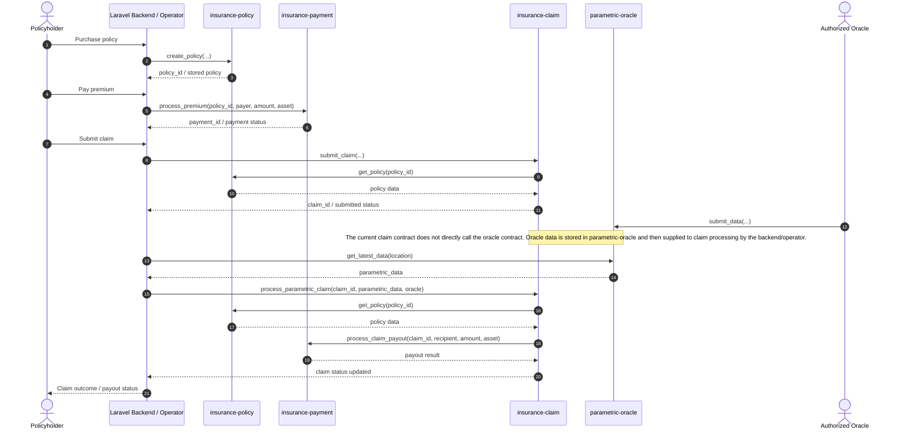

# Smart Contract Specifications

## Overview

Riwe's live Soroban implementation is a **modular 4-contract insurance suite** deployed on **Stellar testnet**. The active contracts are:

1. `insurance-policy`
2. `insurance-claim`
3. `insurance-payment`
4. `parametric-oracle`

This is the current production-intended architecture for the project. All application and documentation references should treat this 4-contract suite as the authoritative deployment model.

## Table of Contents

1. Contract Architecture
2. Insurance Contract Suite
3. DeFi Integration Contracts
4. Governance & Compliance
5. Contract Addresses
6. Deployment Specifications
7. Cross-Contract Call Sequence
8. Storage Key Reference Appendix
9. Security Risks & Mitigations
10. Future Mainnet Readiness Checklist
11. Operational Notes

## Contract Architecture

### Architectural Model

The system follows the standard Soroban pattern of **Rust contract code -> WASM build -> contract deployment -> on-chain initialization**. The architecture is intentionally split by business responsibility instead of combining all logic in one monolithic contract.

### Contract Relationship Summary

- `insurance-policy` is the core registry for policy creation, storage, and lifecycle data.
- `insurance-claim` manages claim submission, validation, and claim-state decisions.
- `insurance-payment` handles premium and payout orchestration and maintains token-aware payment flows.
- `parametric-oracle` manages authorized oracle inputs and retained environmental data used in parametric decisions.

### Interaction Flow

1. A policy is created and managed in `insurance-policy`.
2. Payment-related actions are coordinated through `insurance-payment`.
3. A claim is submitted and evaluated in `insurance-claim`.
4. Oracle-fed external conditions are supplied through `parametric-oracle`.
5. Approved claim and payout flows rely on cross-contract coordination between claim and payment modules.

### Architecture Flow Diagram

```mermaid
flowchart TD
    U[Policyholder / Farmer]
    B[Laravel Backend / Operator]
    P[insurance-policy]
    C[insurance-claim]
    PAY[insurance-payment]
    O[parametric-oracle]
    ORA[Authorized Oracle]
    S[(Soroban Storage)]
    T[Token / Asset Flow]

    U -->|purchase request| B
    B -->|create_policy(...)| P
    P -->|policy records| S

    U -->|premium payment| B
    B -->|process_premium(...)| PAY
    PAY -->|payment state / pool accounting| S
    PAY --> T

    U -->|claim submission| B
    B -->|submit_claim(...)| C
    C -->|get_policy(policy_id)| P
    C -->|claim records| S

    ORA -->|submit_data(...)| O
    O -->|oracle submissions| S
    B -->|get_latest_data(...)| O
    B -->|process_parametric_claim(...)| C
    C -->|get_policy(policy_id)| P
    C -->|process_claim_payout(...)| PAY
    PAY -->|payout records| S
    PAY --> T
```

### Shared Components

The `contracts/shared` crate is **not** a deployed smart contract. It provides shared types, validation helpers, events, and error definitions used across the four deployable contracts.

## Cross-Contract Call Sequence



## Insurance Contract Suite

### 1. `insurance-policy`

**Role:** policy registry and lifecycle manager.

- Creates and stores policy records
- Tracks policy lifecycle and configuration
- Exposes contract configuration for downstream modules
- Serves as the foundational contract referenced by claim and payment flows

Initialize signature:

- `initialize(admin, oracles, minimum_confidence_score, auto_payout_threshold, fee_percentage, fee_recipient)`

| Area | Current Surface |
| --- | --- |
| Functions | `initialize`, `create_policy`, `activate_policy`, `suspend_policy`, `cancel_policy`, `expire_policies`, `get_policy`, `get_policy_status`, `is_policy_active`, `get_policies_by_holder`, `get_active_policies`, `get_expired_policies`, `get_policy_count`, `update_config`, `get_config` |
| Events | `PolicyCreated`, `PolicyActivated`, `PolicyExpired` |
| State | `Config`, `Policy(policy_id)`, `PolicyCount`, `PoliciesByHolder(address)`, `ActivePolicies`, `ExpiredPolicies` |

### 2. `insurance-claim`

**Role:** claim intake, validation, and claim decision engine.

- Accepts claim submissions
- Validates policy-linked claim context
- Coordinates with policy and payment contracts
- Supports claim approval, rejection, and payout-triggered flows

Initialize signature:

- `initialize(admin, oracles, minimum_confidence_score, auto_payout_threshold, fee_percentage, fee_recipient, policy_contract, payment_contract)`

| Area | Current Surface |
| --- | --- |
| Functions | `initialize`, `submit_claim`, `process_parametric_claim`, `approve_claim`, `reject_claim`, `mark_claim_paid`, `get_claim`, `get_claim_status`, `get_claims_by_claimant`, `get_claims_by_policy`, `get_pending_claims`, `get_approved_claims`, `get_rejected_claims`, `get_paid_claims`, `get_claim_count`, `update_config`, `get_config` |
| Events | `ClaimSubmitted`, `ClaimApproved`, `ClaimRejected`, `ParametricTriggerActivated` |
| State | `Config`, `Claim(claim_id)`, `ClaimCount`, `ClaimsByClaimant(address)`, `ClaimsByPolicy(policy_id)`, `PendingClaims`, `ApprovedClaims`, `RejectedClaims`, `PaidClaims`, `PolicyContract`, `PaymentContract` |

### 3. `insurance-payment`

**Role:** premium collection and payout orchestration layer.

- Handles payment-related business logic
- Maintains supported token configuration
- Coordinates payouts with claim and policy-linked records
- Acts as the primary on-chain financial execution module in the suite

Initialize signature:

- `initialize(admin, oracles, minimum_confidence_score, auto_payout_threshold, fee_percentage, fee_recipient, policy_contract, claim_contract, supported_tokens)`

| Area | Current Surface |
| --- | --- |
| Functions | `initialize`, `process_premium`, `process_claim_payout`, `get_payment`, `get_payments_by_payer`, `get_payments_by_policy`, `get_pool_balance`, `get_supported_tokens`, `update_config`, `get_config` |
| Events | `PaymentProcessed` with `Premium` and `Payout` payment types |
| State | `Config`, `Payment(payment_id)`, `PaymentCount`, `PaymentsByPayer(address)`, `PaymentsByRecipient(address)`, `PaymentsByPolicy(policy_id)`, `PaymentsByClaim(claim_id)`, `PendingPayments`, `CompletedPayments`, `FailedPayments`, `PolicyContract`, `ClaimContract`, `InsurancePool`, `SupportedTokens` |

### 4. `parametric-oracle`

**Role:** oracle authorization and parametric data ingestion.

- Stores authorized oracle identities
- Accepts retained external data inputs
- Enforces confidence-score-based data quality requirements
- Supports parametric insurance evaluation with trusted off-chain inputs

Initialize signature:

- `initialize(admin, authorized_oracles, data_retention_period, minimum_confidence_score)`

| Area | Current Surface |
| --- | --- |
| Functions | `initialize`, `submit_data`, `get_latest_data`, `get_historical_data`, `get_oracle_submissions`, `get_submission_count`, `add_oracle`, `remove_oracle`, `get_config`, `update_config` |
| Events | No explicit `env.events().publish(...)` usage was found in the current contract source, although the shared event model defines `OracleDataSubmitted` for the domain |
| State | `Config`, `Submission(submission_id)`, `SubmissionsByOracle(address)`, `SubmissionsByLocation(location)`, `LatestSubmission(location)`, `SubmissionCount`, `DataRetentionPeriod` |

## DeFi Integration Contracts

### Current Reality

There is **no separate deployed DeFi contract suite** in the current live Riwe Soroban architecture. The repository does not currently expose live on-chain lending, staking, liquidity, or governance contracts as part of the active deployment.

### Existing DeFi-Oriented Integration Points

- `insurance-payment` is the main contract that touches token-aware financial flows.
- Supported assets/tokens are handled through Soroban-compatible token interactions.
- The Laravel/backend layer coordinates account, wallet, and funding operations around the on-chain contracts.

### Documentation Rule

Any future DeFi integrations should be documented as either:

- **planned / future integrations**, or
- **off-chain application integrations**

They should **not** be presented as deployed contracts unless they actually exist on-chain and have real contract IDs.

## Governance & Compliance

### Governance Model

There is currently **no separate on-chain governance contract** deployed for Riwe. Governance is presently handled through contract configuration and privileged admin-controlled operations.

### Security and Control Patterns

- Admin-controlled initialization establishes the core contract configuration.
- Soroban authorization checks such as `require_auth()` are used for protected operations.
- Oracle authorization is controlled through allow-listed oracle identities.
- Confidence thresholds and validation rules help prevent invalid or low-quality external data from driving payouts.

### Compliance Considerations

- Business compliance, operator review, and customer/process governance remain primarily **off-chain** in the application/backend layer.
- The on-chain layer is focused on deterministic execution, state control, and audit-friendly separation of responsibilities.
- This separation is appropriate for the current testnet-stage architecture.

### Contract Function / Event / State Design Notes

- Function surfaces are intentionally separated by domain: policy, claim, payment, and oracle.
- Event coverage is currently strongest in the policy, claim, and payment contracts.
- Storage is segmented by contract responsibility, which reduces accidental state coupling and simplifies auditing.
- TTL extension helpers are part of the storage design and are operationally important on Soroban testnet.

## Contract Addresses

### Live Testnet Deployment

| Contract | Purpose | Contract ID |
| --- | --- | --- |
| `insurance-policy` | Policy creation, storage, lifecycle, config | `CCRXGROY4THHIB7QRGMJHBXXN7TPMVEYGBBEFVKGWQXOYH4RHJDB3SHR` |
| `insurance-claim` | Claim submission, validation, processing | `CCFYJDOFQAQT5DVB2UNU4SWOXMVFLLVWNG47J6G5ZPQGPDMRWSXO75WQ` |
| `insurance-payment` | Premium/payout orchestration, token support | `CAWLYJZHPSZ7YLXGTAPARWEW27GNDQ7ZLJVWW5RKN27XKSOJOGRDPEVT` |
| `parametric-oracle` | Authorized oracle data ingestion | `CBYGCVAFPPYVLKWZE2XQKX6RMPLBCNBZKWOVHTJIJX3LSRNYRZSI7TTM` |

### Mainnet Status

**No mainnet deployment exists yet.**

Any previously documented mainnet addresses were placeholders and are not valid production references.

## Deployment Specifications

### Build and Deployment Standard

- Contract language: Rust
- Smart contract platform: Soroban on Stellar
- WASM target: `wasm32v1-none`
- CLI used for deployment/invocation: `stellar`

### Network Configuration

- Network: `testnet`
- RPC URL: `https://soroban-testnet.stellar.org`
- Network passphrase: `Test SDF Network ; September 2015`

### Deployment Model

The deployment flow is:

1. build each contract to WASM
2. deploy each WASM artifact to Soroban
3. initialize contracts with runtime configuration
4. persist resulting contract IDs into application configuration

### Current Testnet Initialization Values

- `admin`: `GAEKJI3PXTBY27YVOIOB4AFY5GOMXSRAVVMO3LEN456HIK3J4QZEJFT7`
- `oracles`: `[]`
- `authorized_oracles`: `[]`
- `minimum_confidence_score`: `70`
- `auto_payout_threshold`: `80`
- `fee_percentage`: `100`
- `fee_recipient`: `GAEKJI3PXTBY27YVOIOB4AFY5GOMXSRAVVMO3LEN456HIK3J4QZEJFT7`
- `data_retention_period`: `86400`
- `supported_tokens`: `[]`

### Application Configuration Mapping

The live contract IDs are loaded from `.env` and consumed through `config('stellar.insurance.*')`.

- `STELLAR_POLICY_CONTRACT_ID`
- `STELLAR_CLAIM_CONTRACT_ID`
- `STELLAR_PAYMENT_CONTRACT_ID`
- `STELLAR_ORACLE_CONTRACT_ID`

## Storage Key Reference Appendix

### `insurance-policy`

| Storage Key | Purpose |
| --- | --- |
| `Config` | Contract-level admin/oracle/fee configuration |
| `Policy(String)` | Individual policy record by policy ID |
| `PolicyCount` | Global policy counter used in policy indexing |
| `PoliciesByHolder(Address)` | Policy IDs grouped by policyholder |
| `ActivePolicies` | Active-policy registry/list |
| `ExpiredPolicies` | Expired-policy registry/list |

### `insurance-claim`

| Storage Key | Purpose |
| --- | --- |
| `Config` | Claim-contract admin/oracle/fee configuration |
| `Claim(String)` | Individual claim record by claim ID |
| `ClaimCount` | Global claim counter |
| `ClaimsByClaimant(Address)` | Claim IDs grouped by claimant |
| `ClaimsByPolicy(String)` | Claim IDs grouped by policy |
| `PendingClaims` | Claims awaiting review or automated processing |
| `ApprovedClaims` | Approved claim registry/list |
| `RejectedClaims` | Rejected claim registry/list |
| `PaidClaims` | Paid-claim registry/list |
| `PolicyContract` | Referenced `insurance-policy` contract address |
| `PaymentContract` | Referenced `insurance-payment` contract address |

### `insurance-payment`

| Storage Key | Purpose |
| --- | --- |
| `Config` | Payment-contract admin/oracle/fee configuration |
| `Payment(String)` | Individual payment/payout record by payment ID |
| `PaymentCount` | Global payment counter |
| `PaymentsByPayer(Address)` | Payment IDs grouped by payer |
| `PaymentsByRecipient(Address)` | Payout/payment IDs grouped by recipient |
| `PaymentsByPolicy(String)` | Payment IDs grouped by policy |
| `PaymentsByClaim(String)` | Payout IDs grouped by claim |
| `PendingPayments` | Pending payment registry/list |
| `CompletedPayments` | Completed payment registry/list |
| `FailedPayments` | Failed payment registry/list |
| `PolicyContract` | Referenced `insurance-policy` contract address |
| `ClaimContract` | Referenced `insurance-claim` contract address |
| `InsurancePool` | Aggregated pool/accounting state |
| `SupportedTokens` | Allowed payment assets/tokens |

### `parametric-oracle`

| Storage Key | Purpose |
| --- | --- |
| `Config` | Oracle admin/oracle/confidence configuration |
| `Submission(String)` | Individual oracle submission by submission ID |
| `SubmissionsByOracle(Address)` | Submission IDs grouped by oracle address |
| `SubmissionsByLocation(Location)` | Submission IDs grouped by insured location |
| `LatestSubmission(Location)` | Latest known submission per location |
| `SubmissionCount` | Global oracle-submission counter |
| `DataRetentionPeriod` | Freshness/retention window for stored oracle data |

## Security Risks & Mitigations

| Risk Area | Current Mitigation | Additional Mainnet Expectation |
| --- | --- | --- |
| Unauthorized admin actions | Admin-gated initialization and config updates; Soroban auth checks such as `require_auth()` | Use hardened operational controls for admin keys, rotation policies, and restricted signer access |
| Invalid or malicious oracle inputs | Authorized oracle lists, confidence thresholds, validation logic | Use non-empty production oracle sets, key rotation, monitoring, and incident response for bad feeds |
| Cross-contract payout inconsistency | Modular separation and explicit claim/payment coordination | Add deeper end-to-end scenario coverage for payout failure and retry paths |
| Token / payment misconfiguration | Supported-token tracking and explicit payment configuration | Whitelist real production assets and validate decimals, issuers, and treasury accounts before launch |
| Expiring Soroban state on testnet | TTL renewal helpers added across contracts | Define production TTL monitoring, renewal automation, and archival/recovery procedures |
| Configuration or documentation drift | `.env` and `config('stellar.insurance.*')` are the active runtime source of truth | Keep deployment runbooks, environment templates, and operator docs aligned to the live 4-contract suite |
| Network and deployment mistakes | Deployment is explicit and contract IDs are persisted after deploy | Require a signed deployment runbook, release approval, and post-deploy verification checklist |
| Incomplete event observability | Policy, claim, and payment emit domain events | Expand event coverage where useful, especially around oracle submissions and admin changes |

## Future Mainnet Readiness Checklist

- [ ] Complete a focused security review / external audit of the 4-contract suite
- [ ] Confirm all runtime paths, env templates, and runbooks reference only the live 4-contract suite
- [ ] Finalize production admin-account custody, signer policy, and secret-management process
- [ ] Define and provision the mainnet oracle set instead of using empty oracle lists
- [ ] Finalize supported production tokens/assets for `insurance-payment`
- [ ] Run end-to-end tests covering policy creation, premium collection, claim approval, rejection, payout, and oracle-driven parametric flows
- [ ] Validate failover handling for Soroban RPC, Horizon access, and deployment tooling
- [ ] Define monitoring for TTL/state health, failed invocations, payout failures, and oracle anomalies
- [ ] Add a formal release / rollback runbook for contract deployment and app config updates
- [ ] Confirm backend config caching, environment rollout, and operational handoff procedures
- [ ] Reconcile docs so only live architecture and current deployment paths are presented as authoritative
- [ ] Fund and secure the required mainnet operational accounts before production launch

## Operational Notes

- The earlier disappearing-state issue on testnet was caused by a combination of stale Laravel config lookups and Soroban TTL/state expiration.
- The current contract suite includes TTL renewal helpers to reduce the risk of expiring state on testnet.
- Runtime integrations should use the env-backed `stellar.insurance.*` values as the source of truth.
- Testnet should still be treated as non-production infrastructure even when deployments are successful.
