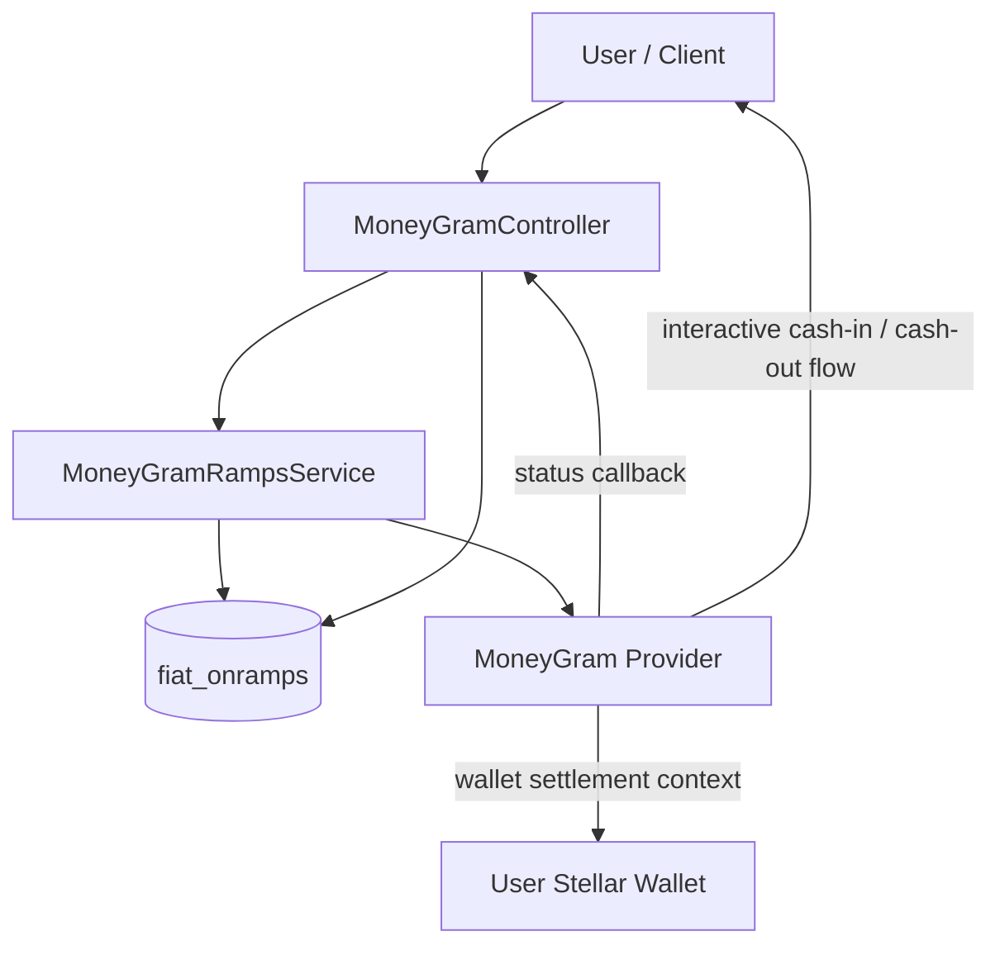

# MoneyGram Integration

This document describes Riwe's current MoneyGram integration as a backend-managed USDC cash-ramp for Stellar wallets. It is grounded in the live application surfaces currently implemented in `config/services.php`, `routes/moneygram.php`, `app/Services/MoneyGramRampsService.php`, and `app/Http/Controllers/MoneyGramController.php`.

The document is intentionally conservative. It separates:

- current implemented behavior
- current support and sandbox tooling
- production hardening work that is still required

Related docs: [TECHNICAL_ARCHITECTURE.md](../TECHNICAL_ARCHITECTURE.md) · [08-DeFi-Wallet-System.md](./DeFi-and-Moneygram-Claims-Payout.md) · [12-Fiat-Integration.md](./Fiat-Currencies.md)

## Contents

- [Current role in platform](#current-role-in-platform)
- [Current implementation status](#current-implementation-status)
- [Architecture and component model](#architecture-and-component-model)
- [Protocol posture](#protocol-posture)
- [Configuration surface](#configuration-surface)
- [Route surface](#route-surface)
- [Operational flows](#operational-flows)
- [Wallet prerequisites and request validation](#wallet-prerequisites-and-request-validation)
- [Asset, network, and corridor scope](#asset-network-and-corridor-scope)
- [Transaction records and reconciliation](#transaction-records-and-reconciliation)
- [Status lifecycle and webhook handling](#status-lifecycle-and-webhook-handling)
- [Sandbox and non-sandbox behavior](#sandbox-and-non-sandbox-behavior)
- [Security, compliance, and support operations](#security-compliance-and-support-operations)
- [Current implementation boundaries](#current-implementation-boundaries)
- [Production hardening roadmap](#production-hardening-roadmap)
- [Conclusion](#conclusion)

## Current role in platform

MoneyGram is a current application-layer provider integration for cash-in and cash-out using **USDC on Stellar**. In Riwe's architecture it is not a smart contract, not a standalone settlement ledger, and not the primary claims engine. It is attached to the wallet layer and used as a fiat or cash corridor around a Stellar wallet account.

From a business-flow perspective, MoneyGram is intended to support both **premium payments** and **claim settlement**. In the current codebase, those insurance-specific uses are expressed through generic wallet-linked deposit and withdrawal flows rather than dedicated premium- or claim-specific MoneyGram endpoints.

Its current role is:

- enabling interactive USDC deposit initiation into a user's Stellar account, including premium-funding use cases
- enabling interactive USDC withdrawal initiation out of a user's Stellar account, including claim-settlement and cash-out use cases
- supporting insurance payment flows where premium collection or claim disbursement needs a provider-mediated fiat or cash corridor around the Stellar wallet
- storing local MoneyGram-linked transaction records in `fiat_onramps`
- receiving provider status callbacks and normalizing them into Riwe transaction states

This preserves the broader wallet-centric model used elsewhere in the application docs: MoneyGram interacts around the Stellar wallet, while premium and claim business logic remain coordinated by backend and contract-orchestration layers.

## Current implementation status

| Surface | Current status | Notes |
| --- | --- | --- |
| Backend service integration | Implemented | `MoneyGramRampsService` manages provider-facing calls and sandbox behavior |
| Controller and route surface | Implemented | Public, authenticated web, and Sanctum API routes are present |
| Interactive deposit and withdrawal initiation | Implemented | Current code uses MoneyGram interactive transaction endpoints or sandbox substitutes |
| Wallet prerequisite checks | Implemented | Deposit and withdrawal require a `stellarWallet` or `walletPlus` record |
| Local transaction persistence | Implemented | MoneyGram flows create `FiatOnramp` records with provider `moneygram` |
| Status normalization | Implemented | Provider states are mapped into local `pending`, `processing`, `completed`, and `failed` outcomes |
| Webhook and status reconciliation | Implemented with caveats | Current code contains an identifier mismatch described later in this document |
| Sandbox simulation tooling | Implemented | Sandbox page, test-suite helpers, and report-generation routes exist |
| Production approval | Not documented as current | The presence of approval tooling does not by itself mean production approval is complete |
| Fully hosted local SEP auth server | Not documented as current | The current repo exposes MoneyGram route groups, not a full local SEP-10 server implementation |

## Architecture and component model

The MoneyGram integration is distributed across configuration, controller, service, route, and persistence layers.

| Component | Current responsibility |
| --- | --- |
| `config/services.php` | Environment, credentials, network selection, USDC issuers, limits, currencies, and KYC thresholds |
| `routes/moneygram.php` | Public info and webhook routes, authenticated wallet-facing routes, and Sanctum API routes |
| `MoneyGramController` | Validation, authentication boundaries, wallet prerequisite checks, JSON or HTML responses, and support tooling |
| `MoneyGramRampsService` | Provider info lookup, deposit initiation, withdrawal initiation, status lookup, sandbox behavior, and webhook-driven updates |
| `FiatOnramp` | Local provider transaction record, user linkage, currency amounts, provider references, and metadata |

## Protocol posture

The current integration should be described as a **SEP-24-style interactive ramp integration** rather than a full standalone locally hosted SEP implementation.

What the current code does:

- calls a MoneyGram `info` endpoint in non-sandbox mode
- posts to `transactions/deposit/interactive` for deposits
- posts to `transactions/withdraw/interactive` for withdrawals
- passes an `on_change_callback` webhook URL back to Riwe

What should not be overstated:

- the current repo does not expose a complete local `/api/sep/interactive/*` surface in `routes/moneygram.php`
- the current reviewed code does not show a complete locally hosted SEP-10 auth workflow for Riwe itself
- the integration therefore should be documented as provider-driven interactive ramp handling, not as a complete independently operated SEP server stack

## Configuration surface

`config/services.php` defines the current MoneyGram integration surface through the following keys:

- `services.moneygram.environment`
- `services.moneygram.base_url`
- `services.moneygram.client_id`
- `services.moneygram.client_secret`
- `services.moneygram.stellar_network`
- `services.moneygram.home_domain`
- `services.moneygram.signing_key`
- `services.moneygram.webhook_secret`
- `services.moneygram.usdc.*`
- `services.moneygram.limits.*`
- `services.moneygram.supported_currencies`
- `services.moneygram.kyc.*`

### Current asset and network configuration

| Network | Asset | Current configured issuer |
| --- | --- | --- |
| `testnet` | USDC | `GBBD47IF6LWK7P7MDEVSCWR7DPUWV3NY3DTQEVFL4NAT4AQH3ZLLFLA5` |
| `mainnet` | USDC | `GA5ZSEJYB37JRC5AVCIA5MOP4RHTM335X2KGX3IHOJAPP5RE34K4KZVN` |

The service derives the active issuer from `services.moneygram.stellar_network`, which defaults through `STELLAR_NETWORK` and currently operates in a sandbox-first posture.

### Current transaction limits

| Flow | Minimum | Maximum |
| --- | --- | --- |
| Deposit / on-ramp | 5 USDC | 950 USDC |
| Withdrawal / off-ramp | 5 USDC | 2500 USDC |

### KYC threshold configuration

The current service configuration also includes:

- `required_for_amounts_above = 100`
- `enhanced_kyc_threshold = 1000`

These values are useful operational thresholds, but the presence of configuration alone should not be treated as proof that the entire UX, controller, provider, and compliance workflow is already production-complete end to end.

## Route surface

`routes/moneygram.php` currently exposes three main route groups.

### Public routes under `/moneygram/*`

| Route | Current purpose |
| --- | --- |
| `GET /moneygram/info` | Service information |
| `POST /moneygram/webhook` | Provider callback receiver |
| `GET /moneygram/options` | Supported currencies, limits, asset, and network |
| `GET /moneygram/sandbox/{token}` | Sandbox simulation page |
| `GET /moneygram/test-suite` | Test-suite UI |
| `GET /moneygram/download-report/{filename}` | Report download helper |
| `GET /moneygram/transaction/{id}` | Transaction detail page |

### Authenticated web routes under `/moneygram/*`

| Route | Current purpose |
| --- | --- |
| `GET /moneygram` | MoneyGram UI entry point |
| `POST /moneygram/deposit` | Deposit initiation |
| `POST /moneygram/withdrawal` | Withdrawal initiation |
| `GET /moneygram/transactions` | User transaction list |
| `GET /moneygram/transactions/{id}` | User transaction detail |

### Sanctum API routes under `/api/moneygram/*`

| Route | Current purpose |
| --- | --- |
| `GET /api/moneygram/info` | API-facing info route |
| `GET /api/moneygram/options` | API-facing options route |
| `POST /api/moneygram/deposit` | API deposit initiation |
| `POST /api/moneygram/withdrawal` | API withdrawal initiation |
| `GET /api/moneygram/transactions` | API transaction list |
| `GET /api/moneygram/transactions/{id}` | API transaction detail |
| `POST /api/moneygram/test-case` | Test case execution helper |
| `POST /api/moneygram/generate-report` | Test report generation helper |

## Operational flows

### Service information and options

`MoneyGramController::info()` calls `MoneyGramRampsService::getInfo()` and returns JSON for API-style requests or an HTML view for browser requests.

`MoneyGramController::getSupportedOptions()` returns:

- `supported_currencies`
- `limits`
- `asset_code`
- `asset_issuer`
- `network`

This makes the options endpoint the most accurate live summary of the currently configured MoneyGram corridor surface.

### Insurance-specific business usage

Within Riwe's insurance flows, MoneyGram should be understood as a provider rail for two main business cases:

1. **Premium payments**
   - the current implementation path is a MoneyGram deposit flow that settles value into the user's Stellar wallet or account context
   - that wallet-linked value can then support premium-related application or contract flows

2. **Claim settlement**
   - the current implementation path is a MoneyGram withdrawal flow tied to the user's Stellar wallet or account context
   - this supports claim-disbursement and cash-settlement use cases once payout value is available for withdrawal

The important implementation boundary is that the repository currently exposes generic `deposit` and `withdrawal` operations. It does not yet expose dedicated MoneyGram routes named specifically for premium collection or claim payout settlement.

### Deposit flow

For premium-payment and general funding use cases, the current deposit path is:

1. the user calls `POST /moneygram/deposit` or `POST /api/moneygram/deposit`
2. the controller validates amount and currency
3. the controller confirms the user has a `stellarWallet` or `walletPlus`
4. `MoneyGramRampsService::initiateDeposit(...)` builds a provider payload containing:
   - `asset_code = USDC`
   - the active `asset_issuer`
   - `amount`
   - `source_asset`
   - `account = $user->stellar_account_id`
   - `memo_type`
   - `memo`
   - `on_change_callback = route('moneygram.webhook')`
5. sandbox mode returns a Riwe-hosted sandbox URL and mock instructions; non-sandbox mode posts to MoneyGram's interactive deposit endpoint
6. a local `FiatOnramp` record is created with provider `moneygram` and type `deposit`
7. the response returns a local transaction ID, provider ID when present, an interactive URL, and instructions

### Withdrawal flow

For claim-settlement and general cash-out use cases, the current withdrawal path is similar, with `MoneyGramRampsService::initiateWithdrawal(...)` using `dest_asset` for the requested cash-out currency.

The flow is:

1. the user calls `POST /moneygram/withdrawal` or `POST /api/moneygram/withdrawal`
2. the controller validates amount and currency
3. the controller blocks demo-user withdrawals
4. the controller confirms the user has a `stellarWallet` or `walletPlus`
5. the service builds the provider payload and returns either sandbox data or a non-sandbox interactive session
6. a local `FiatOnramp` record is created with provider `moneygram` and type `withdrawal`

## Wallet prerequisites and request validation

The current controller enforces practical wallet and request constraints before invoking the MoneyGram service.

| Check | Current behavior |
| --- | --- |
| Wallet presence | User must have either `stellarWallet` or `walletPlus` |
| Deposit amount | `min:5`, `max:950` |
| Withdrawal amount | `min:5`, `max:2500` |
| Deposit currencies | `USD, EUR, GBP, CAD, AUD, NGN, KES, GHS, ZAR` |
| Withdrawal currencies | `USD, EUR, GBP, CAD, AUD, NGN, KES, GHS, ZAR` |
| Demo account restriction | Withdrawal is blocked for `isDemoUser()` |

If a user has neither a Stellar wallet nor a Wallet Plus record, the controller returns a wallet-required error and does not attempt a provider call.

## Asset, network, and corridor scope

### Settlement asset

The MoneyGram integration is currently modeled around **USDC on Stellar**. The user's `stellar_account_id` is the account identifier passed into deposit and withdrawal initiation payloads.

### Configured currencies versus currently enforced request surface

The current configuration includes the following broader list of supported currencies:

- `USD`, `EUR`, `GBP`, `CAD`, `AUD`
- `NGN`, `KES`, `GHS`, `ZAR`
- `MXN`, `BRL`, `INR`, `PHP`, `THB`, `VND`, `IDR`, `MYR`, `SGD`

However, the current controller validation accepts a narrower live request surface:

- `USD`, `EUR`, `GBP`, `CAD`, `AUD`, `NGN`, `KES`, `GHS`, `ZAR`

For operational and documentation purposes, the narrower controller-enforced set should be treated as the effective request interface until validation, UX, and provider corridor coverage are aligned.

### Corridor and timing guidance

Actual corridor availability can vary by environment, compliance state, provider requirements, and agent availability. The current code does not establish a fixed end-to-end processing SLA, so the documentation should avoid promising exact processing times as if they were guaranteed platform behavior.

## Transaction records and reconciliation

Every initiated MoneyGram flow creates a local `FiatOnramp` record. Important fields in the current model include:

| Field | Current role |
| --- | --- |
| `provider` | Provider name, currently `moneygram` |
| `provider_reference` | Provider-facing reference stored at creation time |
| `provider_transaction_id` | Provider transaction ID when available |
| `type` | `deposit` or `withdrawal` |
| `status` | Local lifecycle state |
| `fiat_amount` / `fiat_currency` | User-facing fiat request details |
| `crypto_amount` / `crypto_currency` | Stellar-side asset amount, currently modeled as USDC |
| `metadata` | Stored provider response, Stellar account, memo, and webhook updates |
| `provider_webhook_data` | Model-supported provider webhook storage field |

### Current reconciliation nuance

The current initiation logic writes `provider_reference` and `provider_transaction_id`.

By contrast, the current webhook and transaction-refresh logic looks up `external_transaction_id` when attempting to reconcile status updates. No matching `external_transaction_id` definition was found in the current application surfaces reviewed for this document.

That means the current integration should be described as having **webhook and status-update plumbing present**, but not yet as a fully normalized production-grade reconciliation model. Before production hardening, identifier usage should be standardized across create, lookup, webhook, and refresh paths.

## Status lifecycle and webhook handling

`MoneyGramRampsService::mapMoneyGramStatus(...)` currently maps provider statuses into local Riwe transaction states.

| Provider status | Local status | Operational meaning |
| --- | --- | --- |
| `pending_user_transfer_start` | `pending` | User still needs to begin or complete the provider-side step |
| `pending_anchor` | `processing` | Provider-side processing is underway |
| `pending_stellar` | `processing` | Settlement-side processing is underway |
| `pending_external` | `processing` | External processing is underway |
| `pending_trust` | `pending` | Waiting on trustline or asset-side preconditions |
| `pending_user` | `pending` | Waiting on user action |
| `completed` | `completed` | Provider flow reached terminal success |
| `error` | `failed` | Provider flow failed |
| `incomplete` | `failed` | Provider flow did not complete |

The webhook entry point is `POST /moneygram/webhook`. In the current reviewed implementation:

- the controller forwards the payload to `MoneyGramRampsService::handleWebhook(...)`
- the service checks for `id` and `status`
- if a matching record is found, the local status is updated and the payload is appended into local metadata

## Sandbox and non-sandbox behavior

Sandbox mode is a first-class part of the current implementation.

### Sandbox behavior

When `services.moneygram.environment === sandbox`:

- `getInfo()` returns a mock service-info payload
- deposit initiation returns a mock MoneyGram ID and a Riwe sandbox URL
- withdrawal initiation returns a mock MoneyGram ID and a Riwe sandbox URL
- instructions are generated locally for testing and support flows

### Non-sandbox behavior

When the environment is not sandbox:

- `getInfo()` performs an HTTP `GET` against the configured MoneyGram base URL
- deposit initiation performs an HTTP `POST` to `transactions/deposit/interactive`
- withdrawal initiation performs an HTTP `POST` to `transactions/withdraw/interactive`

This split is important: successful sandbox flows demonstrate application integration and UX behavior, but they should not be presented as proof of production approval or end-to-end production readiness.

## Security, compliance, and support operations

### Current security and access controls

The current implementation includes:

- authenticated deposit, withdrawal, and transaction routes
- Sanctum-protected API equivalents for frontend or mobile clients
- controller-level input validation for amounts and currencies
- wallet prerequisite checks before provider calls
- configurable provider credentials and a configurable webhook secret

### Current compliance posture

From an industry and operations perspective, the integration should be understood as a regulated provider corridor around a Stellar wallet. Practical controls include:

- wallet ownership and authenticated user access
- local provider-reference storage for traceability
- configurable KYC thresholds in service configuration
- the ability to keep support and audit context in local transaction records

### Support and approval tooling

The current route surface also includes:

- a sandbox simulation page
- test-case execution helpers
- test-report generation and download helpers

These are useful support and integration artifacts, but they should be documented as tooling, not as evidence that production approval is already complete.

## Current implementation boundaries

The following boundaries are important for engineering, operations, and documentation accuracy.

1. **The integration is sandbox-first by default**
   - Sandbox behavior is deeply built into `getInfo()`, deposit initiation, and withdrawal initiation.
   - Documentation should not imply that all currently described flows are operating against production MoneyGram credentials.

2. **Configured currencies are broader than the current controller-validated interface**
   - The configuration lists 18 currencies.
   - The controller currently accepts a smaller subset.

3. **Webhook reconciliation needs identifier normalization**
   - Creation logic stores `provider_reference` and `provider_transaction_id`.
   - Webhook and refresh logic currently reference `external_transaction_id`.

4. **Webhook secret configuration exists, but signature verification is not visible in the reviewed request path**
   - `services.moneygram.webhook_secret` exists in configuration.
   - The current controller and service path shown in the reviewed code accepts the payload and processes it without visible signature verification.

5. **Production approval should not be claimed from route or test-helper presence alone**
   - The repo contains support routes for sandbox and testing.
   - That is not the same as a formally approved, production-active provider rollout.

6. **Fixed processing-time claims should be avoided**
   - Corridor timings can vary materially by provider conditions, user actions, KYC state, and environment.
   - The current code does not establish a platform SLA that should be documented as guaranteed behavior.

## Production hardening roadmap

Before this integration should be presented as production-hardened, the following work should be completed:

1. normalize transaction identifiers across initiation, refresh, and webhook paths
2. add explicit webhook signature validation using the configured webhook secret
3. align configured supported currencies with controller validation and frontend UX
4. confirm production credentialing, corridor scope, and provider-approval status before documenting them as current
5. validate end-to-end wallet trustline, funding, and cash-ramp behavior on the intended Stellar network mode
6. formalize KYC and compliance enforcement across controller, provider, and support workflows
7. document operational runbooks for failed, incomplete, delayed, or disputed transactions
8. add targeted automated tests around MoneyGram status handling, webhook processing, and transaction reconciliation

## Conclusion

Riwe has a real MoneyGram integration surface today: configuration, routes, controller logic, service orchestration, sandbox behavior, and local transaction persistence are all present in the application.

The most accurate technical description of the current state is:

- MoneyGram is a backend-managed USDC cash-ramp for Stellar wallets and is intended to support premium-payment and claim-settlement business flows
- the current implementation is interactive and sandbox-first
- local transaction tracking is implemented through `FiatOnramp`
- the current code expresses those business flows through wallet-linked deposit and withdrawal operations rather than dedicated insurance-specific MoneyGram endpoints
- additional reconciliation, webhook-verification, and production-readiness work is still required before the integration should be documented as fully production-hardened or formally approved
