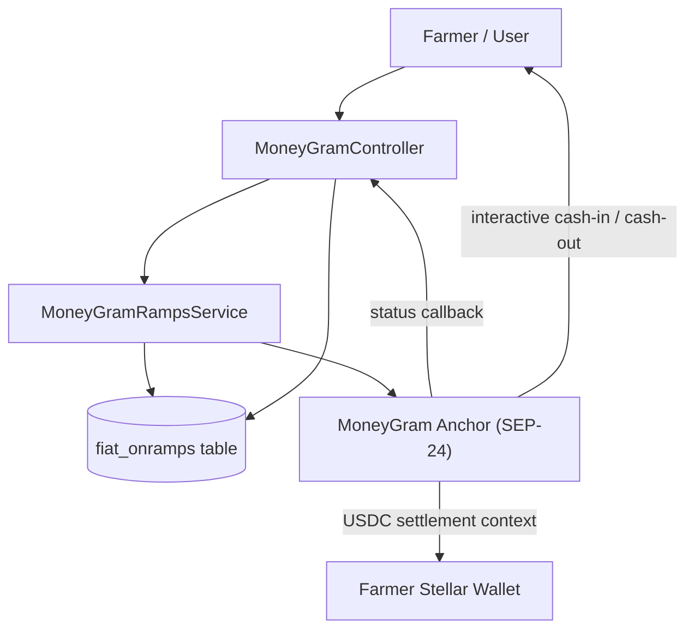

# MoneyGram Integration
## Riwe Technologies — Last-Mile USDC/NGN Settlement Rail on Stellar

**Related documentation:** [Soroban Smart Contracts Overview ←](./Soroban-Smart-Contracts-Overview.md) · [System Architecture ←](./System-Architecture.md) · [DeFi Wallet and MoneyGram Claims Payout](./DeFi-and-Moneygram-Claims-Payout.md) · [Fiat Currencies](./Fiat-Currencies.md)

---

## Table of Contents

1. [Why MoneyGram on Stellar](#why-moneygram-on-stellar)
2. [Implementation Status](#implementation-status)
3. [Role in the Insurance Protocol](#role-in-the-insurance-protocol)
4. [Architecture and Component Model](#architecture-and-component-model)
5. [Protocol Posture](#protocol-posture)
6. [Configuration Surface](#configuration-surface)
7. [Route Surface](#route-surface)
8. [Operational Flows](#operational-flows)
9. [Wallet Prerequisites and Request Validation](#wallet-prerequisites-and-request-validation)
10. [Asset, Network, and Corridor Scope](#asset-network-and-corridor-scope)
11. [Transaction Records and Reconciliation](#transaction-records-and-reconciliation)
12. [Status Lifecycle and Webhook Handling](#status-lifecycle-and-webhook-handling)
13. [Sandbox and Non-Sandbox Behaviour](#sandbox-and-non-sandbox-behaviour)
14. [Security and Compliance](#security-and-compliance)
15. [Known Implementation Gaps](#known-implementation-gaps)
16. [Production Hardening — SCF Tranche Mapping](#production-hardening--scf-tranche-mapping)

---

## Why MoneyGram on Stellar

Riwe's insurance model requires two things that traditional financial infrastructure cannot deliver together: instant on-chain claim settlement and last-mile NGN cash disbursement to farmers with no bank account.

Stellar solves the settlement side — USDC transfers between Soroban contracts and farmer wallets are near-instant and permanently auditable. MoneyGram solves the last-mile side — as a SEP-24 anchor on Stellar, MoneyGram converts USDC to NGN and disburses cash through its agent network across Nigeria, Kenya, and Ghana. A farmer in Benue State with no bank account can collect a verified climate insurance payout in cash within 48 hours of a satellite trigger being confirmed on-chain.

This combination is not achievable with any other stack. Traditional payment providers do not offer programmatic USDC settlement. MoneyGram's Stellar-native Access product is the only rail that connects on-chain USDC settlement directly to last-mile cash disbursement in the markets where Riwe operates.

The MoneyGram last-mile settlement rail is explicitly listed as **Product 4** in the SCF #42 submission. The service layer architecture, routes, and sandbox tooling described in this document form the pre-production foundation that T2 funds will activate and validate end-to-end.

---

## Implementation Status

The MoneyGram integration is **pre-production**. The service layer, routes, controller, configuration, and local persistence scaffolding have been designed and partially built, but the integration is not yet live against the MoneyGram anchor. All items below are either in progress or pending the relevant SCF tranche.

| Component | Status | SCF Tranche |
|---|---|---|
| `MoneyGramRampsService` — service class scaffolding | 🔲 Sandbox only — not production-active | T2 Deliverable 3 |
| Controller and route surface | 🔲 Scaffolded — not production-active | T2 Deliverable 1 |
| Interactive deposit initiation | 🔲 Sandbox simulation only | T2 Deliverable 3 |
| Interactive withdrawal initiation | 🔲 Sandbox simulation only | T2 Deliverable 3 |
| Wallet prerequisite checks | 🔲 Scaffolded | T2 Deliverable 1 |
| Local transaction persistence (`fiat_onramps`) | 🔲 Scaffolded | T2 Deliverable 3 |
| Status normalisation | 🔲 Scaffolded | T2 Deliverable 3 |
| Webhook plumbing | 🔲 Scaffolded — identifier gap noted | T2 Deliverable 3 |
| Sandbox simulation tooling | 🔲 For development use only | — |
| SEP-10 backend authentication | 🔲 Not yet implemented | T2 Deliverable 1 |
| SEP-24 live anchor integration | 🔲 Not yet activated | T2 Deliverable 3 |
| Webhook signature verification | 🔲 Not yet implemented | T2 Deliverable 3 |
| Transaction identifier normalisation | 🔲 Known gap — to be resolved | T2 Deliverable 3 |
| Production credentialling and approval | 🔲 Not complete | T2 Deliverable 3 |
| End-to-end validation (MoneyGram test anchor) | 🔲 Not yet run | T2 Deliverable 3 |
| UX/UI designs for SEP-24 withdrawal flows | 🔲 Not yet designed | T1 Deliverable 3 |

---

## Role in the Insurance Protocol

MoneyGram is planned as an application-layer provider integration for USDC cash-in and cash-out using Stellar wallets. It is not a smart contract, not a standalone settlement ledger, and not the primary claims engine. It is designed to operate around the Stellar wallet layer as a fiat corridor for two specific insurance flows:

**1. Premium collection (deposit → USDC pool)**

A farmer pays NGN via a MoneyGram agent or the app. The value is converted to USDC and credited to the farmer's Stellar wallet, which is then used to fund the `insurance-payment` pool via the Soroban `process_premium()` call. This is the designed flow — not yet live.

**2. Claim disbursement (USDC → NGN cash)**

Once the `insurance-payment` Soroban contract releases USDC to a farmer's Stellar wallet following a confirmed parametric trigger, the MoneyGram withdrawal flow is designed to convert that USDC to NGN and disburse cash at a local agent point within 48 hours.

The important boundary is that the codebase currently scaffolds generic `deposit` and `withdrawal` operations. Insurance-specific orchestration — routing claim payouts from the Soroban payment contract through to MoneyGram withdrawal — is a T2 integration deliverable.

---

## Architecture and Component Model

The planned MoneyGram integration is distributed across configuration, controller, service, route, and persistence layers.

| Component | Planned responsibility |
|---|---|
| `config/services.php` | Environment, credentials, network selection, limits, currencies, KYC thresholds |
| `routes/moneygram.php` | Public info and webhook routes, authenticated wallet-facing routes, Sanctum API routes |
| `MoneyGramController` | Validation, authentication boundaries, wallet prerequisite checks, JSON and HTML responses, support tooling |
| `MoneyGramRampsService` | Provider info lookup, deposit initiation, withdrawal initiation, status lookup, sandbox behaviour, webhook updates |
| `FiatOnramp` | Local provider transaction record, user linkage, currency amounts, provider references, metadata |

---

## Protocol Posture

The planned integration is designed as a **SEP-24-style interactive ramp integration** using MoneyGram as the anchor. It is not a full standalone locally hosted SEP server.

What the designed flow will do:

- call a MoneyGram `info` endpoint in non-sandbox mode
- post to `transactions/deposit/interactive` for deposits
- post to `transactions/withdraw/interactive` for withdrawals
- pass an `on_change_callback` webhook URL back to Riwe for status reconciliation

What is not yet built and should not be overstated:

- a complete locally hosted SEP-10 auth workflow — this is a T2 Deliverable 1 item
- end-to-end live flows against the MoneyGram anchor — this is T2 Deliverable 3
- a production-approved corridor — this requires formal provider approval confirmation in T2

---

## Configuration Surface

`config/services.php` defines the planned MoneyGram integration configuration keys:

- `services.moneygram.environment`
- `services.moneygram.base_url`
- `services.moneygram.client_id`
- `services.moneygram.client_secret`
- `services.moneygram.stellar_network`
- `services.moneygram.home_domain`
- `services.moneygram.signing_key`
- `services.moneygram.webhook_secret`
- `services.moneygram.usdc.*`
- `services.moneygram.limits.*`
- `services.moneygram.supported_currencies`
- `services.moneygram.kyc.*`

### Asset and network configuration

The service is designed to operate with **USDC on Stellar** as the settlement asset. USDC issuer addresses will be configured from official Stellar and MoneyGram documentation at the time of T2 production activation. No issuer addresses are hardcoded here — they are environment-configured and subject to confirmation against the live MoneyGram anchor at T2 time.

### Transaction limits (planned)

| Flow | Minimum | Maximum |
|---|---|---|
| Deposit / on-ramp | 5 USDC | 950 USDC |
| Withdrawal / off-ramp | 5 USDC | 2,500 USDC |

These limits are scaffolded in configuration. Final limits will be confirmed against MoneyGram's production corridor requirements in T2.

### KYC threshold configuration (planned)

Configuration includes:
- `required_for_amounts_above` — threshold above which KYC verification is required
- `enhanced_kyc_threshold` — threshold for enhanced due diligence

These values are configuration scaffolding. Full KYC and compliance enforcement across the controller, provider, and support workflows is a T2 hardening item.

---

## Route Surface

`routes/moneygram.php` defines the planned route surface across three groups.

### Public routes under `/moneygram/*`

| Route | Purpose |
|---|---|
| `GET /moneygram/info` | Service information |
| `POST /moneygram/webhook` | Provider status callback receiver |
| `GET /moneygram/options` | Supported currencies, limits, asset, and network |
| `GET /moneygram/sandbox/{token}` | Sandbox simulation page (development only) |
| `GET /moneygram/test-suite` | Test-suite UI (development only) |
| `GET /moneygram/download-report/{filename}` | Report download helper (development only) |
| `GET /moneygram/transaction/{id}` | Transaction detail page |

### Authenticated web routes under `/moneygram/*`

| Route | Purpose |
|---|---|
| `GET /moneygram` | MoneyGram UI entry point |
| `POST /moneygram/deposit` | Deposit initiation |
| `POST /moneygram/withdrawal` | Withdrawal initiation |
| `GET /moneygram/transactions` | User transaction list |
| `GET /moneygram/transactions/{id}` | User transaction detail |

### Sanctum API routes under `/api/moneygram/*`

| Route | Purpose |
|---|---|
| `GET /api/moneygram/info` | API-facing info |
| `GET /api/moneygram/options` | API-facing options |
| `POST /api/moneygram/deposit` | API deposit initiation |
| `POST /api/moneygram/withdrawal` | API withdrawal initiation |
| `GET /api/moneygram/transactions` | API transaction list |
| `GET /api/moneygram/transactions/{id}` | API transaction detail |
| `POST /api/moneygram/test-case` | Test case execution (development only) |
| `POST /api/moneygram/generate-report` | Test report generation (development only) |

All routes above are scaffolded. They operate in sandbox mode until T2 production activation.

---

## Operational Flows

### Premium payment (deposit — designed flow)

1. Farmer calls `POST /moneygram/deposit` or `POST /api/moneygram/deposit`
2. Controller validates amount and currency
3. Controller confirms the user has a `stellarWallet` or `walletPlus` record
4. `MoneyGramRampsService::initiateDeposit()` builds the provider payload:
   - `asset_code = USDC`
   - `asset_issuer` (configured at T2 activation)
   - `amount`
   - `source_asset`
   - `account = farmer Stellar account ID`
   - `memo_type`, `memo`
   - `on_change_callback = route('moneygram.webhook')`
5. In sandbox mode: returns a Riwe-hosted sandbox URL and mock instructions
6. In production (T2): posts to MoneyGram's interactive deposit endpoint and returns an anchor URL
7. A local `FiatOnramp` record is created with provider `moneygram` and type `deposit`

### Claim disbursement (withdrawal — designed flow)

1. Claim payout confirmed by `insurance-payment` Soroban contract — USDC in farmer wallet
2. Farmer calls `POST /moneygram/withdrawal` or `POST /api/moneygram/withdrawal`
3. Controller validates amount and currency; blocks demo-user withdrawals
4. Controller confirms the user has a `stellarWallet` or `walletPlus` record
5. `MoneyGramRampsService::initiateWithdrawal()` builds the provider payload with `dest_asset` for requested cash-out currency
6. In sandbox mode: returns mock MoneyGram ID and sandbox URL
7. In production (T2): posts to MoneyGram's interactive withdrawal endpoint; anchor handles USDC debit and NGN disbursement
8. A local `FiatOnramp` record is created with provider `moneygram` and type `withdrawal`

---

## Wallet Prerequisites and Request Validation

The planned controller enforces the following before invoking the MoneyGram service:

| Check | Planned behaviour |
|---|---|
| Wallet presence | User must have either `stellarWallet` or `walletPlus` |
| Deposit amount | `min: 5 USDC`, `max: 950 USDC` |
| Withdrawal amount | `min: 5 USDC`, `max: 2,500 USDC` |
| Demo account restriction | Withdrawal blocked for demo users |

If a user has neither a Stellar wallet nor a Wallet Plus record, the controller returns a wallet-required error and does not attempt a provider call.

---

## Asset, Network, and Corridor Scope

### Settlement asset

The MoneyGram integration is designed around **USDC on Stellar**. The farmer's `stellar_account_id` is the account identifier passed into deposit and withdrawal payloads.

### Supported currencies (planned)

The controller is scaffolded to accept the following currencies for deposit and withdrawal requests:

`USD, EUR, GBP, CAD, AUD, NGN, KES, GHS, ZAR`

The full configuration also references additional currencies for future expansion. For documentation purposes, the controller-enforced set above is the effective planned interface for T2 launch.

### Corridor and timing

Actual corridor availability, processing times, and agent network coverage depend on MoneyGram production approval, provider conditions, KYC state, and agent availability. No fixed processing SLA should be stated as a platform guarantee — the 48-hour disbursement target is the designed goal, contingent on end-to-end production validation in T2.

---

## Transaction Records and Reconciliation

Every initiated MoneyGram flow is designed to create a local `FiatOnramp` record.

| Field | Purpose |
|---|---|
| `provider` | Provider name — `moneygram` |
| `provider_reference` | Provider-facing reference stored at creation |
| `provider_transaction_id` | Provider transaction ID when available |
| `type` | `deposit` or `withdrawal` |
| `status` | Local lifecycle state |
| `fiat_amount` / `fiat_currency` | User-facing fiat request details |
| `crypto_amount` / `crypto_currency` | Stellar-side USDC amount |
| `metadata` | Provider response, Stellar account, memo, webhook updates |
| `provider_webhook_data` | Provider webhook storage |

### Known identifier gap

The current scaffolding has a reconciliation inconsistency: creation logic writes `provider_reference` and `provider_transaction_id`, but the webhook and transaction-refresh logic references `external_transaction_id` — which has no matching definition in the current codebase. This means the webhook and status-update plumbing is scaffolded but not yet producing a fully normalised reconciliation model. Resolving this is a **T2 Deliverable 3** task.

---

## Status Lifecycle and Webhook Handling

`MoneyGramRampsService::mapMoneyGramStatus()` is designed to map provider states into local Riwe transaction states.

| Provider status | Local status | Operational meaning |
|---|---|---|
| `pending_user_transfer_start` | `pending` | User still needs to complete provider-side action |
| `pending_anchor` | `processing` | Provider-side processing underway |
| `pending_stellar` | `processing` | Stellar settlement underway |
| `pending_external` | `processing` | External processing underway |
| `pending_trust` | `pending` | Waiting on trustline or asset preconditions |
| `pending_user` | `pending` | Waiting on user action |
| `completed` | `completed` | Provider flow reached terminal success |
| `error` | `failed` | Provider flow failed |
| `incomplete` | `failed` | Provider flow did not complete |

The webhook entry point is `POST /moneygram/webhook`. The designed flow:
- Controller forwards the payload to `MoneyGramRampsService::handleWebhook()`
- Service checks for `id` and `status`
- If a matching record is found, local status is updated and payload appended to metadata

**Note:** Webhook signature verification using the configured `webhook_secret` is not yet implemented. Adding explicit signature validation is a **T2 Deliverable 3** hardening task.

---

## Sandbox and Non-Sandbox Behaviour

Sandbox mode is a first-class part of the planned implementation and the current state of the codebase.

### Sandbox behaviour (current state)

When `services.moneygram.environment === sandbox`:
- `getInfo()` returns a mock service-info payload
- Deposit initiation returns a mock ID and a Riwe-hosted sandbox URL
- Withdrawal initiation returns a mock ID and a Riwe-hosted sandbox URL
- Instructions are generated locally for development and testing

### Non-sandbox behaviour (T2 target)

When the environment is set to production:
- `getInfo()` performs an HTTP `GET` against the configured MoneyGram base URL
- Deposit initiation posts to `transactions/deposit/interactive`
- Withdrawal initiation posts to `transactions/withdraw/interactive`

Successful sandbox flows demonstrate application structure and UX behaviour. They do not constitute evidence of production approval or live anchor readiness — that is the T2 Deliverable 3 milestone.

---

## Security and Compliance

### Planned security controls

| Control | Status |
|---|---|
| Authenticated deposit, withdrawal, and transaction routes | 🔲 Scaffolded |
| Sanctum-protected API equivalents | 🔲 Scaffolded |
| Controller-level input validation | 🔲 Scaffolded |
| Wallet prerequisite checks before provider calls | 🔲 Scaffolded |
| Configurable provider credentials and webhook secret | 🔲 Configured — not yet enforced in request path |
| Webhook signature verification | 🔲 T2 Deliverable 3 |
| SEP-10 wallet authentication | 🔲 T2 Deliverable 1 |

### Compliance posture

The integration is designed around a regulated provider corridor. Planned controls include:
- Wallet ownership and authenticated user access
- Local provider-reference storage for traceability
- Configurable KYC thresholds
- Support and audit context in local transaction records

Full KYC and compliance enforcement across controller, provider, and support workflows is a T2 hardening item.

---

## Known Implementation Gaps

The following gaps are documented accurately to support engineering and review:

1. **Sandbox-first by default** — all current MoneyGram flows operate in sandbox mode. No production credential activation has been documented as complete.

2. **Transaction identifier inconsistency** — creation logic stores `provider_reference` and `provider_transaction_id`; webhook and refresh logic references `external_transaction_id`, which has no current matching definition. This must be normalised before production.

3. **Webhook signature verification absent** — `services.moneygram.webhook_secret` is configured, but the current controller and service path does not yet validate incoming webhook signatures against it.

4. **SEP-10 not yet implemented** — the current codebase does not include a complete locally hosted SEP-10 authentication workflow. This is a T2 Deliverable 1 item.

5. **Currency alignment gap** — the full configuration references a broader currency list than the controller currently validates. The controller-enforced set should be treated as the effective interface until frontend UX and provider corridor coverage are fully aligned.

6. **No fixed processing SLA** — corridor timings vary by provider conditions, user actions, KYC state, and environment. Processing time targets in product communications should be framed as goals, not platform guarantees, until end-to-end production validation is complete.

---

## Production Hardening — SCF Tranche Mapping

The following items must be completed before the MoneyGram integration is production-ready. Each item is mapped to the funded SCF tranche that delivers it.

| Task | SCF Tranche | Deliverable |
|---|---|---|
| SEP-10 backend authentication implementation | T2 | Deliverable 1 — Testnet Deployment & Backend Integration |
| SEP-6/SEP-24 deposit and withdrawal handling activated | T2 | Deliverable 1 — Testnet Deployment & Backend Integration |
| UX/UI designs for full SEP-10 + SEP-24 flow (8+ screens) | T1 | Deliverable 3 — MoneyGram UX/UI Architecture |
| Normalise transaction identifiers across create, refresh, and webhook paths | T2 | Deliverable 3 — E2E Integration & MoneyGram Simulation |
| Add explicit webhook signature verification using configured `webhook_secret` | T2 | Deliverable 3 — E2E Integration & MoneyGram Simulation |
| Align supported currencies between configuration, controller validation, and UX | T2 | Deliverable 3 — E2E Integration & MoneyGram Simulation |
| Confirm production credentialling, corridor scope, and provider approval | T2 | Deliverable 3 — E2E Integration & MoneyGram Simulation |
| Validate end-to-end flow against MoneyGram test anchor (video walkthrough) | T2 | Deliverable 3 — E2E Integration & MoneyGram Simulation |
| Formalise KYC and compliance enforcement across controller and provider flows | T2 | Deliverable 3 — E2E Integration & MoneyGram Simulation |
| Operational runbooks for failed, incomplete, delayed, or disputed transactions | T2 | Deliverable 3 — E2E Integration & MoneyGram Simulation |
| Targeted automated tests for status handling, webhook processing, reconciliation | T2 | Deliverable 3 — E2E Integration & MoneyGram Simulation |
| Confirm USDC issuer addresses against live MoneyGram anchor configuration | T2 | Deliverable 3 — E2E Integration & MoneyGram Simulation |
| SEP-30 account recovery for partner-managed wallets | T3 | Deliverable 2 — Institutional Partner Onboarding |

The T2 Deliverable 3 milestone — **E2E Integration & MoneyGram Simulation** — is the single most critical item for this integration. Its completion criteria per the SCF submission are: a GitHub Actions CI report at ≥90% E2E test coverage across the full policy lifecycle, and a recorded video walkthrough of a successful end-to-end withdraw flow from smart contract settlement trigger through to a completed MoneyGram test anchor payout.

---

*Riwe Technologies Limited · riwe.io · partnerships@riwe.io*
