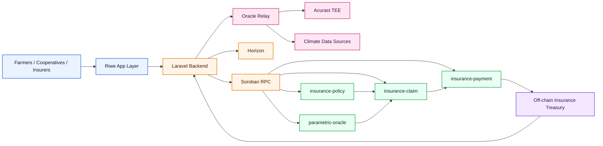
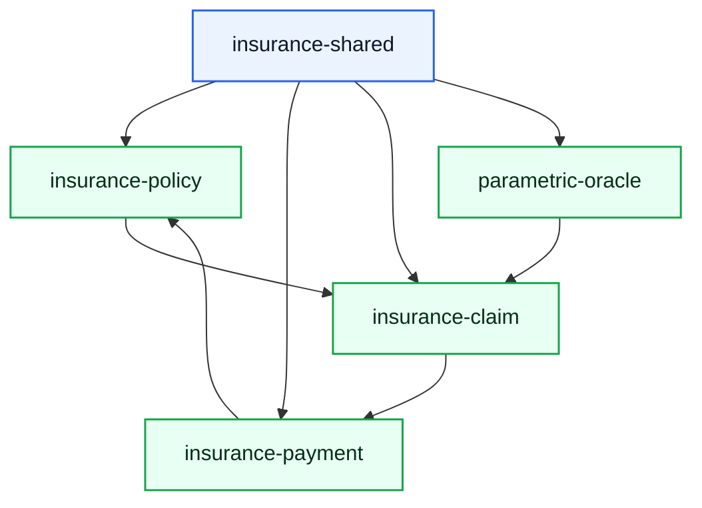
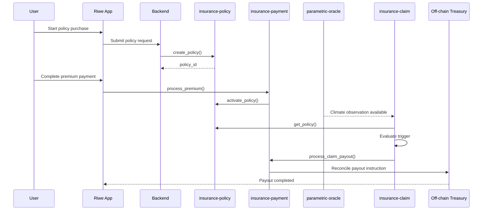
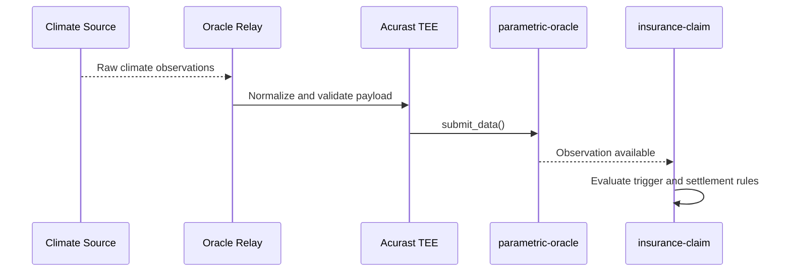
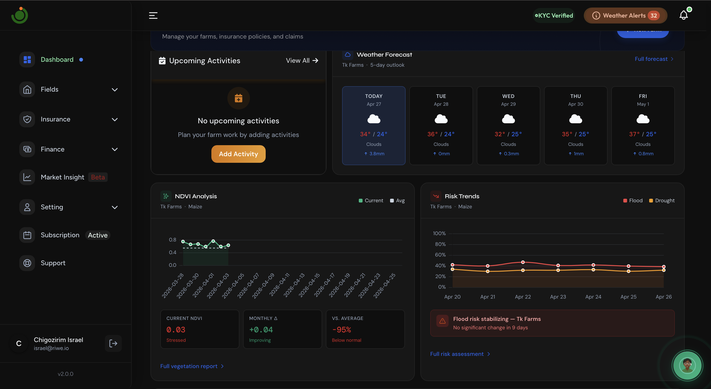
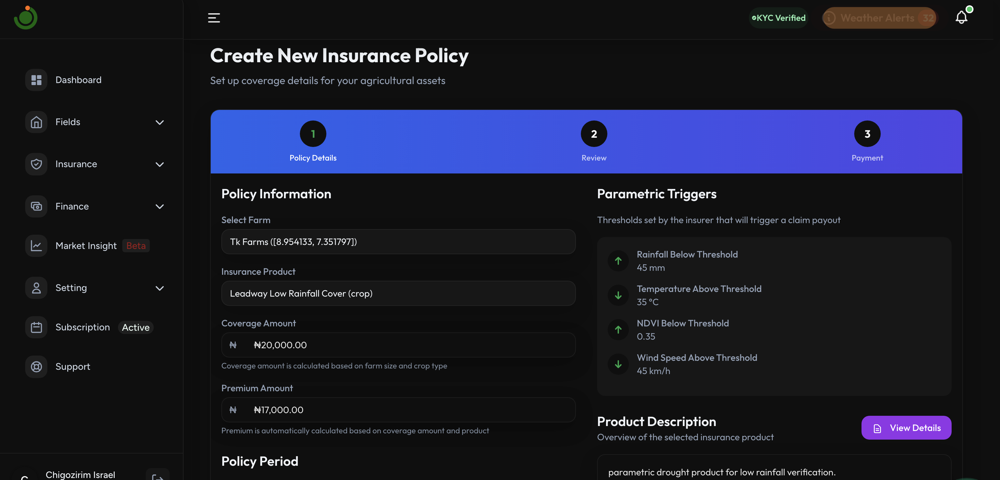
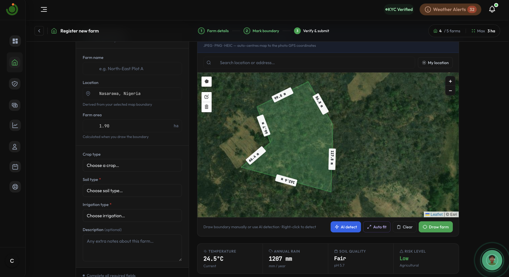
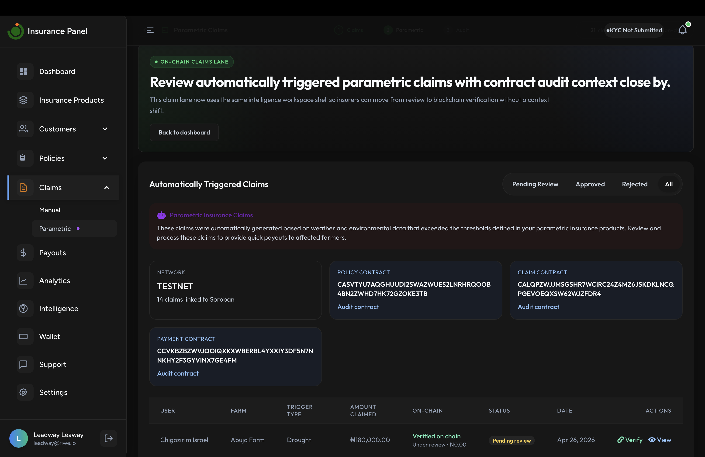
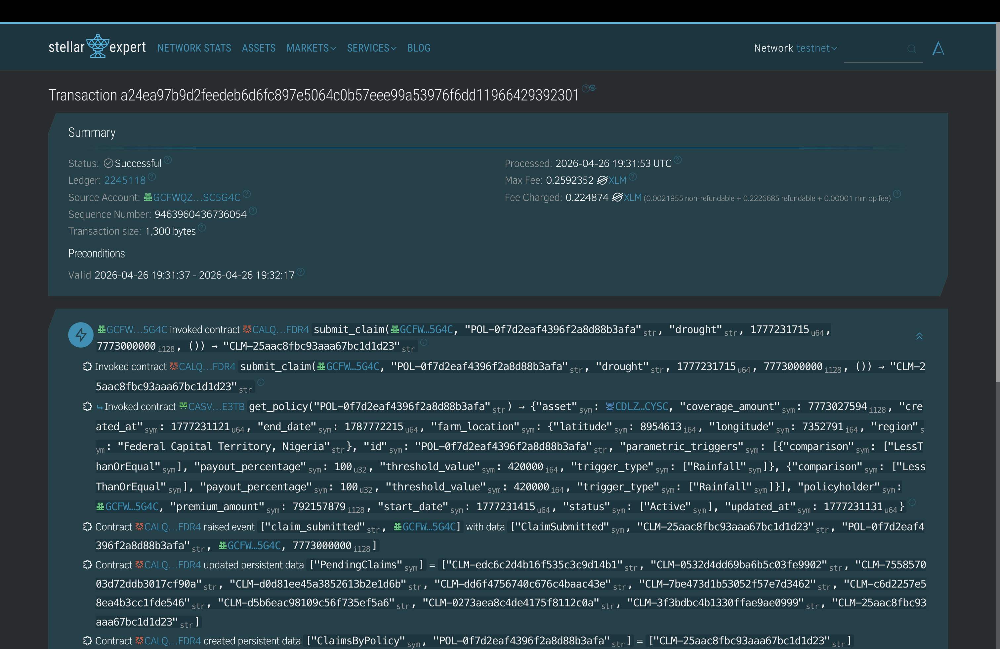
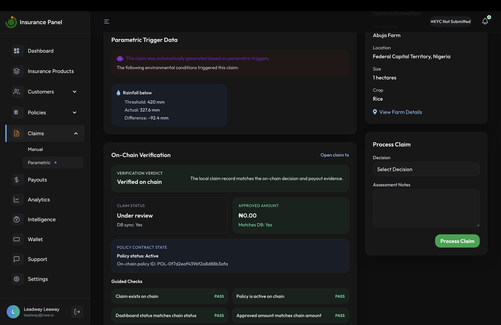

# Riwe
## Technical Architecture Document

## Table of Contents

- [1. Introduction](#1-introduction)
- [2. Riwe Overview](#2-riwe-overview)
- [3. Architecture Constraints](#3-architecture-constraints)
- [4. Architecture Overview](#4-architecture-overview)
- [5. Technology Stack](#5-technology-stack)
- [6. Soroban Contract Overview](#6-soroban-contract-overview)
- [7. Hybrid Insurance Model](#7-hybrid-insurance-model)
- [8. Policy and Settlement Flow](#8-policy-and-settlement-flow)
- [9. Oracle Architecture](#9-oracle-architecture)
- [10. Trigger Model](#10-trigger-model)
- [11. Current State and SCF43 Target](#11-current-state-and-scf43-target)
- [12. Product Screens and Workflow Evidence](#12-product-screens-and-workflow-evidence)
- [13. Deliverables](#13-deliverables)
- [14. Risks and Controls](#14-risks-and-controls)

### 1. Introduction - Company Overview

Riwe is building a parametric climate insurance protocol on Stellar for smallholder farmers, cooperatives, and insurance partners. We aim to bridge the protection gap by solving the major issues for the low insurance up take across Nigeria and Africa; claims disputes and delays, policy adminsitraive bottlenecks, high premiums and logisticsl nightmare of claims adjusters, all of which are responsbile for less than 1% insurance pentration rate in Nigeria and less than 0.3% across the Nigerian Agricultural value chain, leaving over 30 million farmers vulnerable to climate shocks. 

Riwe is not the underwriter. Our Insurance partners underwrite the products and carry the regulated insurance risk. Riwe provides the infrastructure layer: policy workflows, climate-trigger verification, claims state, payout authorization, and partner-facing visibility. Product design is done with actuarial support and in collaboration with insurance partners, who remain responsible for underwriting and regulated treasury operations.

The architecture is intentionally hybrid. Underwriting, reserves, and treasury remain off-chain with regulated insurance partners. Policy state, trigger verification, claim state changes, and payout authorization are anchored on Stellar. This gives insurers and partners a shared, auditable system without forcing regulated insurance operations into an unrealistic fully on-chain model.

### 2. Riwe Overview

Riwe sits between four groups:

- farmers and rural policyholders who need simple coverage and fast payout
- insurers who underwrite the products and hold the regulated risk
- distributors, cooperatives, and embedded finance partners who originate and manage demand
- technical systems that manage policy state, climate triggers, settlement logic, and payout records

Riwe’s role is to make parametric insurance easier to issue, monitor, and settle.

In the operating model we are building:

- insurers approve and underwrite products off-chain
- actuarial and insurance teams help define trigger structures, payout bands, and policy terms
- policy and claim state are anchored on Stellar
- climate events are verified through the oracle pipeline
- payout authorization is recorded on-chain
- insurer treasury teams execute and reconcile payout obligations within regulated off-chain operations

This is the bridge between existing insurance rails and programmable settlement infrastructure.

### 3. Architecture Constraints

While our end goal is for decentralised capital, at the moment, Riwe is being built for a regulated insurance environment. That creates direct architecture constraints:

- underwriting stays with licensed insurance partners
- reserves and treasury stay off-chain with regulated entities
- product terms must map to insurer-approved policies
- the settlement flow is designed to auto-settle clean parametric events and move unresolved cases into controlled fallback states when oracle data is stale, missing, conflicting, or incomplete
- policy creation, trigger verification, claim state changes, and payout authorization are recorded on-chain so insurers can verify settlement activity against regulated treasury and reporting systems

These constraints shape the architecture, and simply define where Stellar creates the most value in the las mile.

Riwe uses Stellar for the parts of the insurance workflow that benefit most from shared state, programmability, and transparent settlement:

- policy registration
- premium-linked activation
- climate-trigger verification
- claim state transitions
- payout authorization

### 4. Architecture Overview

Riwe has six main layers:

- application layer for farmers, partners, and insurers
- backend orchestration layer for policy workflows, treasury coordination, and contract invocation
- oracle execution layer for climate data retrieval, normalization, and authenticated submission
- Soroban contract layer for policy, payment, claim, and oracle state
- settlement layer for SAC-compatible token movement and payout records
- off-chain insurance treasury layer for regulated capital and payout reconciliation

### 5. Technology Stack

Riwe’s current and target architecture uses the following stack:

| Layer | Technology |
|---|---|
| Smart contracts | Rust, Soroban SDK |
| Blockchain network | Stellar |
| Contract interaction | Soroban RPC, Horizon |
| Asset movement | SAC-compatible token flows, stablecoin settlement path |
| Backend | Laravel, PHP |
| Frontend | Blade, JavaScript, Tailwind-based web application stack |
| Oracle execution | Oracle relay service, Acurast TEE target integration |
| Data sources | Climate and satellite data providers used for parametric trigger evaluation |
| Developer tooling | Cargo, Soroban CLI, deployment scripts |
| Monitoring and ops | Application logging, production monitoring, alerting, oracle health checks |

The SCF43 build focuses on the parts of this stack that are directly tied to on-chain policy state, oracle-trigger verification, settlement, and production readiness on Stellar.

### 6. Soroban Contract Overview

Riwe’s core on-chain system is built around four Soroban contracts and one shared types crate.

| Contract | Role | Contract ID | Explorer |
|---|---|---|---|
| `insurance-policy` | Policy registry, lifecycle state, trigger binding | `CASVTYU7AQGHUUDI2SWAZWUES2LNRHRQOOB4BN2ZWHD7HK72GZOKE3TB` | [Stellar Expert](https://stellar.expert/explorer/testnet/contract/CASVTYU7AQGHUUDI2SWAZWUES2LNRHRQOOB4BN2ZWHD7HK72GZOKE3TB) |
| `insurance-claim` | Claim registration, trigger evaluation, payout authorization | `CALQPZWJJMSGSHR7WCIRC24Z4MZ6JSKDKLNCQPGEVOEQXSW62WJZFDR4` | [Stellar Expert](https://stellar.expert/explorer/testnet/contract/CALQPZWJJMSGSHR7WCIRC24Z4MZ6JSKDKLNCQPGEVOEQXSW62WJZFDR4) |
| `insurance-payment` | Premium settlement, payout records, policy activation linkage | `CCVKBZBZWVJOOIQXKXWBERBL4YXXIY3DF5N7NNKHY2F3GYVINX7GE4FM` | [Stellar Expert](https://stellar.expert/explorer/testnet/contract/CCVKBZBZWVJOOIQXKXWBERBL4YXXIY3DF5N7NNKHY2F3GYVINX7GE4FM) |
| `parametric-oracle` | Authenticated climate data submission and storage | `CBYGCVAFPPYVLKWZE2XQKX6RMPLBCNBZKWOVHTJIJX3LSRNYRZSI7TTM` | [Stellar Expert](https://stellar.expert/explorer/testnet/contract/CBYGCVAFPPYVLKWZE2XQKX6RMPLBCNBZKWOVHTJIJX3LSRNYRZSI7TTM) |

#### `insurance-policy`

The `insurance-policy` contract is the policy registry and lifecycle manager.

It is responsible for:

- creating on-chain policy records
- storing policyholder, asset, premium, coverage, coverage period, and location context
- storing trigger definitions at issuance
- managing lifecycle states across `Draft`, `Active`, `Suspended`, `Expired`, and `Cancelled`
- emitting policy lifecycle events

#### `insurance-payment`

The `insurance-payment` contract is the payment and settlement coordination layer.

It is responsible for:

- recording premium settlement
- validating supported token assets
- linking premium confirmation to policy activation
- maintaining payout records
- executing approved on-chain payout instructions
- supporting reconciliation between on-chain settlement state and off-chain treasury movement

#### `insurance-claim`

The `insurance-claim` contract is the claim evaluation and payout authorization layer.

It is responsible for:

- registering claims
- validating claimant and policy eligibility
- evaluating oracle-fed climate observations against stored trigger conditions
- calculating payout amounts
- invoking the payment contract for settlement execution

#### `parametric-oracle`

The `parametric-oracle` contract is the climate data registry.

It is responsible for:

- accepting authenticated submissions from authorized oracle writers
- validating signatures and freshness
- storing current and historical observations
- exposing climate data for claim evaluation and auditability

### 7. Hybrid Insurance Model

Riwe is not trying to move the entire insurance stack on-chain.

The underwriting side remains with licensed insurance partners. The treasury side remains with insurer-controlled off-chain capital and regulated payout operations. Riwe uses on-chain state to make settlement easier to verify and easier to coordinate across stakeholders.

That means:

- policy terms are created with insurer participation
- insurance capital is held off-chain
- claim-trigger verification is anchored on-chain
- payout authorization is anchored on-chain
- treasury teams can verify that payout execution matches the on-chain claim and settlement record

This hybrid model is how we make the system usable in a real insurance market without losing the benefits of shared, programmable state on Stellar.

### 8. Policy and Settlement Flow

The policy flow starts on-chain with policy creation. A new policy remains in `Draft` until premium settlement is completed. The payment contract acts as the activation gate. Once the premium is processed, the payment contract activates the policy through a contract-to-contract call.

When a climate event occurs, the oracle layer submits a signed observation to the `parametric-oracle` contract. The claims contract evaluates that observation against the trigger terms fixed at policy issuance. If the trigger conditions are met and settlement controls pass, the claim moves forward and payout authorization is recorded on-chain. Treasury teams then reconcile and complete the payout within regulated off-chain operations.

### 9. Oracle Architecture

The oracle is the main trust boundary in the system.

Our architecture uses:

- approved climate data sources
- an oracle relay that normalizes source data into a deterministic payload schema
- authenticated submission to the `parametric-oracle` contract
- trigger evaluation inside `insurance-claim`
- settlement controls that prevent auto-payout on weak, stale, or unresolved data

The current implementation already supports:

- authorized oracle signer controls
- signer public keys in contract configuration
- signature validation
- freshness checks
- confidence threshold validation
- on-chain storage of climate submissions
- claim processing based on parametric data

The SCF43 target extends this with:

- TEE-backed execution through Acurast
- stronger replay protection
- explicit handling for stale, missing, and conflicting observations
- improved settlement gating for auto-payout
- production monitoring for oracle liveness and abnormal trigger behavior

### 10. Trigger Model

Each policy stores its own parametric trigger configuration on-chain at issuance.

Each trigger includes:

- trigger type
- threshold value
- comparison operator
- payout percentage

Supported trigger categories in the current architecture include:

- rainfall
- temperature
- humidity
- wind speed
- soil moisture
- NDVI

During claim evaluation, the contract compares submitted climate measurements against the trigger set stored on the policy. If a trigger condition is met, payout is calculated deterministically from the policy’s coverage amount and payout percentage.

### 11. Current State and SCF43 Target

| Layer | Current State | SCF43 Target |
|---|---|---|
| Smart contracts | Core Soroban suite implemented in Rust | Hardened, tested, deployed to Testnet and Mainnet |
| Oracle | Signed allowlisted submission model | TEE-backed relay, stronger failure handling, monitored production path |
| Treasury coordination | Off-chain insurer treasury and operational settlement | Tighter on-chain verification and reconciliation for claims and payouts |
| dApp | Existing insurance application stack | Public testnet flow for policy purchase and settlement visibility |
| Partner tools | Existing insurer and admin workflows | Soroban-aware underwriting and monitoring flows |
| Developer access | Internal integration paths | Public TypeScript SDK and contract client bindings |
| Monitoring | Basic config and logging | Production observability, alerting, oracle health monitoring |

### 12. Product Screens and Workflow Evidence

#### Figure 1. Farmer Dashboard

#### Figure 2. Policy Purchase Flow

#### Figure 3. Farm Onboarding Flow

#### Figure 4. Insurer Dashboard

#### Figure 5. OnChain Trigger Monitoring Workflow on Stellar Expert

#### Figure 6. Claim and Settlement Workflow

### 13. Deliverables

#### Tranche 1

- harden `insurance-policy`, `insurance-payment`, `insurance-claim`, and `parametric-oracle`
- lock trigger terms at issuance and tighten settlement controls
- complete UX/UI for farmer and partner workflows
- define fallback handling for unresolved oracle outcomes

#### Tranche 2

- deploy the contract suite to Stellar Testnet
- integrate the Acurast-backed oracle relay
- launch a public testnet dApp
- validate the full policy and settlement lifecycle

#### Tranche 3

- deploy the protocol to Stellar Mainnet
- publish the TypeScript SDK and contract client bindings
- implement production observability and oracle monitoring
- support live treasury reconciliation and launch operations

### 14. Risks and Controls

The main architecture risks are:

- stale or missing oracle data
- conflicting observations across sources
- unauthorized signer activity
- payout execution failure after trigger resolution
- breakdown between on-chain settlement state and off-chain treasury execution
- backend or RPC coordination failure

Controls in place to mitigate against such:

- signer authorization and revocation paths
- freshness checks and replay protection
- fail-closed settlement behavior
- controlled fallback states instead of forced auto-payout
- oracle health monitoring and anomaly detection
- reconciliation between on-chain claim state and off-chain treasury execution
- operational runbooks and release controls
