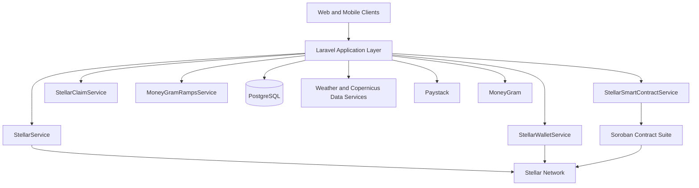
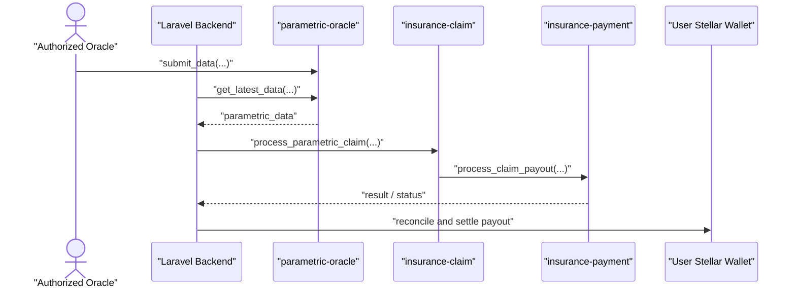

# Riwe Technical Architecture

This document is the top-level technical architecture reference for Riwe's current platform and planned evolution. It focuses especially on the current Stellar integration, the Soroban insurance-contract boundary, wallet settlement, and the MoneyGram cash-ramp architecture.

The document is intentionally conservative. It distinguishes between:

- current implemented application surfaces
- current documented Soroban deployment architecture
- planned work required for fuller end-to-end mainnet readiness

Related docs: [docs/01-System-Architecture.md](./System-Architecture.md) · [docs/04-Soroban-Overview.md](./Soroban-Smart-Contracts-Overview.md) · [docs/05-Contract-Specifications.md](./docs/05-Contract-Specifications.md) · [docs/08-DeFi-Wallet-System.md](./DeFi-and-Moneygram-Claims-Payout.md) · [docs/MONEYGRAM_INTEGRATION.md](./Moneygram-Integration.md)

## Contents

- [Platform baseline](#platform-baseline)
- [Architecture principles](#architecture-principles)
- [Current system topology](#current-system-topology)
- [Current Stellar integration](#current-stellar-integration)
- [Current Soroban contract architecture](#current-soroban-contract-architecture)
- [Current wallet and settlement model](#current-wallet-and-settlement-model)
- [Current MoneyGram architecture](#current-moneygram-architecture)
- [Operational data model](#operational-data-model)
- [Security, observability, and controls](#security-observability-and-controls)
- [Current implementation boundaries](#current-implementation-boundaries)
- [Planned Stellar and MoneyGram roadmap](#planned-stellar-and-moneygram-roadmap)
- [Conclusion](#conclusion)

## Platform baseline

Riwe currently operates as a Laravel-based application platform with PostgreSQL-backed state, Stellar wallet infrastructure, application-layer fiat integrations, and a modular Soroban insurance suite.

| Layer | Current baseline |
| --- | --- |
| Application framework | Laravel 10 |
| Language runtime | PHP 8.2 |
| Primary data store | PostgreSQL |
| API style | REST-first, Sanctum-protected API groups plus authenticated web routes |
| Blockchain settlement network | Stellar |
| Smart-contract framework | Soroban contracts written in Rust under `contracts/` |
| Current contract suite | `insurance-policy`, `insurance-claim`, `insurance-payment`, `parametric-oracle` |
| Fiat rails | Paystack for bank-oriented flows, MoneyGram for Stellar USDC cash ramps |
| Current contract deployment posture | Documented on Stellar testnet; no mainnet deployment documented yet |

## Architecture principles

The current design should be understood through five rules.

1. **Backend-mediated orchestration**
   - Riwe does not treat the frontend as the integration point for Soroban or provider webhooks.
   - The Laravel backend coordinates policy state, external data, wallet state, provider callbacks, and contract invocation.

2. **Backend-mediated oracle flow**
   - Authorized oracle data is submitted to `parametric-oracle`.
   - The backend retrieves that oracle data.
   - The backend then invokes claim-processing logic using the retrieved oracle context.

3. **Wallet-first settlement**
   - Claim proceeds settle to a Stellar wallet first.
   - After wallet settlement, value can be held, transferred, or off-ramped using supported rails such as MoneyGram.

4. **Fiat rails are application integrations, not smart contracts**
   - Paystack and MoneyGram are backend integrations.
   - They are not deployed on-chain components.

5. **Current state and target state must remain separate**
   - Some Stellar and Soroban surfaces are implemented today.
   - Other flows are partially implemented or still placeholder-backed and should not be described as fully live end to end.

## Current system topology

Riwe's current architecture spans client channels, Laravel services, database state, Stellar network operations, Soroban contracts, and fiat off-ramp providers.

### Application and service layers

The current backend owns:

- user authentication and authorization
- policy and claim lifecycle management
- wallet creation and transaction orchestration
- environmental data retrieval from weather and satellite sources
- provider callback and reconciliation handling
- Soroban contract invocation and read paths

The most important current service boundaries are:

| Service | Current role |
| --- | --- |
| `StellarService` | Low-level Stellar gateway for accounts, balances, payments, trustlines, and network configuration |
| `StellarWalletService` | User-wallet lifecycle, encrypted secret handling, balance reads, and payment orchestration |
| `StellarSmartContractService` | Soroban contract IDs, invocation/query plumbing, and policy/claim/payment contract interaction surfaces |
| `StellarClaimService` | Claim submission, environmental trigger evaluation, payout orchestration, and wallet settlement |
| `MoneyGramRampsService` | MoneyGram USDC deposit/withdrawal initiation, sandbox handling, and webhook-driven transaction updates |

## Current Stellar integration

Riwe's current Stellar integration is real at the application and infrastructure layer. The platform already contains service code for account creation, wallet management, trustlines, payments, contract invocation, and claim-related settlement orchestration.

### Network and environment model

`config/stellar.php` currently supports three network profiles.

| Network | Configured purpose | Key characteristics |
| --- | --- | --- |
| `testnet` | Primary current development and documented deployment environment | Horizon testnet URL, Soroban testnet RPC, Friendbot enabled |
| `mainnet` | Planned production network | Horizon mainnet URL, Soroban mainnet RPC, no Friendbot |
| `futurenet` | Additional non-production Soroban environment | Dedicated Horizon/RPC URLs and Futurenet Friendbot |

Important current configuration concepts include:

- `stellar.default_network`
- per-network Horizon and Soroban RPC endpoints
- treasury and fee configuration
- `stellar.insurance.*_contract_id` values for the four-contract suite
- wallet auto-creation and funding settings
- logging and security controls
- mainnet-specific hardening settings under `security.mainnet_security`

### Current Stellar service capabilities

#### `StellarService`

This is the low-level Stellar gateway. It currently provides:

- network initialization from `stellar.default_network`
- SDK initialization against the selected network
- account creation
- Friendbot funding for testnet
- account information retrieval
- payments
- trustline creation and removal helpers
- network configuration exposure for downstream services

This service is the base dependency for higher-level wallet and claim services.

#### `StellarWalletService`

This service implements Riwe's settlement-wallet behavior. It currently supports:

- `createWallet(User $user, bool $fundTestnet = true)`
- optional encryption of secret keys using Laravel `Crypt`
- automatic wallet creation when enabled in configuration
- testnet funding through `StellarService::fundTestnetAccount(...)`
- balance reads
- user-level payment dispatch
- trustline management

Operationally, this means the wallet layer is already a real part of the current application, not just a planned feature.

### Current operational model on Stellar

At the application level, Riwe currently uses Stellar for:

- user wallet creation and activation
- holding and moving settlement balances
- sending claim proceeds to user wallets
- preparing the wallet layer required for USDC cash ramps
- providing the network foundation on which the Soroban insurance suite operates

## Current Soroban contract architecture

The authoritative live contract model is the modular four-contract Soroban insurance suite. This is the only contract architecture that should be described as current.

### Live contract suite

| Contract | Current role | Documented testnet contract ID |
| --- | --- | --- |
| `insurance-policy` | Policy creation, registry, lifecycle state, and policy context | `CCRXGROY4THHIB7QRGMJHBXXN7TPMVEYGBBEFVKGWQXOYH4RHJDB3SHR` |
| `insurance-claim` | Claim submission, validation, and claim-decision logic | `CCFYJDOFQAQT5DVB2UNU4SWOXMVFLLVWNG47J6G5ZPQGPDMRWSXO75WQ` |
| `insurance-payment` | Premium and payout orchestration, token-aware settlement logic | `CAWLYJZHPSZ7YLXGTAPARWEW27GNDQ7ZLJVWW5RKN27XKSOJOGRDPEVT` |
| `parametric-oracle` | Authorized oracle input and retained environmental data | `CBYGCVAFPPYVLKWZE2XQKX6RMPLBCNBZKWOVHTJIJX3LSRNYRZSI7TTM` |

In runtime configuration, these are sourced from environment-backed values in `config/stellar.php` under `stellar.insurance`.

### Contract interaction model

The intended contract relationship remains:

1. policies are created and referenced in `insurance-policy`
2. oracle observations are submitted into `parametric-oracle`
3. the backend retrieves oracle data from `parametric-oracle`
4. the backend invokes claim-processing logic against `insurance-claim`
5. payout logic flows through `insurance-payment`

### Current implementation maturity

The contract architecture above is the documented current design, but the application service layer is not yet uniformly mature across all contract operations.

| Surface | Current status | Notes |
| --- | --- | --- |
| Contract ID configuration | Implemented | `policy_contract_id`, `claim_contract_id`, `payment_contract_id`, and `oracle_contract_id` are configuration-backed |
| Contract invocation plumbing | Implemented | `invokeContract(...)` and `queryContract(...)` exist in `StellarSmartContractService` |
| Policy creation | Partially implemented but real | `createPolicy(...)` invokes the configured `insurance-policy` contract |
| Policy-contract deployment behavior | Shared-contract linking model | `deployContract(...)` links a policy to the configured shared policy contract rather than deploying a dedicated per-policy contract by default |
| Premium processing | Placeholder-backed | `processPremiumPayment(...)` still returns `PLACEHOLDER_HASH` |
| Claim submission | Placeholder-backed | `submitClaim(...)` still returns `PLACEHOLDER_HASH` |
| Parametric payout processing | Placeholder-backed | `processParametricPayout(...)` still returns `PLACEHOLDER_HASH` |
| Mainnet deployment | Not documented as live | Current contract IDs are documented for testnet; no mainnet deployment is documented |

This distinction is important: Riwe already has a real Soroban integration surface, but not every business flow is yet fully wired to a finalized on-chain execution path.

### Current claim-processing orchestration

Riwe currently combines database-backed claim management, environmental trigger evaluation, and Stellar settlement orchestration.

Important current components include:

- `insurance:process-parametric-claims` as the active command surface for automated parametric processing
- weather data retrieval through `WeatherService`
- satellite/vegetation retrieval through `CopernicusService`
- claim orchestration through `StellarClaimService`
- wallet payout dispatch through `StellarService` and `StellarWalletService`

In `StellarClaimService`, the current application flow includes:

- evaluating trigger conditions against environmental data
- creating and submitting claim records
- calling `StellarSmartContractService::processParametricPayout(...)`
- sending payout value to the user's Stellar wallet

The current service code therefore mixes contract-oriented orchestration with direct application-driven wallet settlement. This is a practical current-state boundary and should not be confused with a fully finalized end-to-end on-chain payout pipeline.

## Current wallet and settlement model

Riwe's wallet architecture is central to both current Stellar operations and future fiat exits.

### Settlement layers

| Layer | Current role |
| --- | --- |
| Stellar settlement wallet | Primary destination for policy-related value and claim settlement |
| Custodial multi-network wallet infrastructure | Broader asset-access layer across supported chains |
| Wallet Plus | Self-custodial companion experience adjacent to the custodial stack |

### Current settlement pattern

The current settlement model is:

1. policy and claim state are coordinated by the backend
2. claim outcomes are reflected into wallet settlement flows
3. the user receives value in the Stellar wallet first
4. the user may then keep funds on Stellar, transfer them, or off-ramp them

This wallet-first model is the key bridge between Soroban insurance logic and provider-based fiat access such as MoneyGram.

## Current MoneyGram architecture

MoneyGram is a current application-layer integration for USDC cash-in and cash-out on Stellar. It is not an on-chain contract and should be treated as a provider integration managed entirely from the backend.

### Current role in the platform

MoneyGram currently serves as the Stellar USDC cash-ramp layer for:

- user deposit initiation into a Stellar account
- user withdrawal initiation out of a Stellar account
- post-payout cash-out after wallet settlement
- provider-driven status updates and reconciliation

### Current configuration model

`config/services.php` currently defines the MoneyGram integration surface with:

- `environment`
- `base_url`
- `client_id`
- `client_secret`
- `stellar_network`
- `home_domain`
- `signing_key`
- `webhook_secret`
- per-network USDC issuer configuration
- on-ramp and off-ramp limits

The current default environment is sandbox-oriented, and the service determines the USDC issuer from the configured Stellar network.

Current configured USDC issuers:

| Network | Asset | Issuer |
| --- | --- | --- |
| Testnet | USDC | `GBBD47IF6LWK7P7MDEVSCWR7DPUWV3NY3DTQEVFL4NAT4AQH3ZLLFLA5` |
| Mainnet | USDC | `GA5ZSEJYB37JRC5AVCIA5MOP4RHTM335X2KGX3IHOJAPP5RE34K4KZVN` |

Current configured limits:

| Flow | Minimum | Maximum |
| --- | --- | --- |
| Deposit / on-ramp | 5 USDC | 950 USDC |
| Withdrawal / off-ramp | 5 USDC | 2500 USDC |

### Current service behavior

`MoneyGramRampsService` currently provides:

- `getInfo()` for service metadata
- `initiateDeposit(...)` for interactive deposit creation
- `initiateWithdrawal(...)` for interactive withdrawal creation
- `getTransactionStatus(...)` for provider status retrieval
- `handleWebhook(...)` for local transaction updates

Important current implementation details:

- sandbox mode returns mock `/info` data and mock interactive URLs
- deposit and withdrawal payloads include the user's `stellar_account_id`
- both flows attach an `on_change_callback` pointing to the MoneyGram webhook route
- local `FiatOnramp` records are created with `provider = moneygram`
- local metadata stores the provider response, wallet account, and generated memo reference

### Current route surface

`routes/moneygram.php` currently exposes three route groups.

| Route group | Purpose |
| --- | --- |
| Public `/moneygram/*` | service info, webhook, options, sandbox page, test-suite/reporting, transaction detail |
| Authenticated `/moneygram/*` | deposit, withdrawal, transaction list/detail, wallet-facing MoneyGram interface |
| Sanctum `/api/moneygram/*` | frontend/API integration for info, options, deposits, withdrawals, transactions, and test/report utilities |

### Current transaction lifecycle mapping

MoneyGram webhook statuses are currently normalized into local Riwe statuses.

| MoneyGram status | Local status |
| --- | --- |
| `pending_user_transfer_start` | `pending` |
| `pending_anchor` | `processing` |
| `pending_stellar` | `processing` |
| `pending_external` | `processing` |
| `pending_trust` | `pending` |
| `pending_user` | `pending` |
| `completed` | `completed` |
| `error` | `failed` |
| `incomplete` | `failed` |

### Current MoneyGram role in payout flows

From an architecture standpoint, MoneyGram sits after wallet settlement, not before it.

The current intended sequence is:

1. a claim settles to the user's Stellar wallet
2. the user retains or moves the value on Stellar
3. if cash-out is requested, the backend initiates a MoneyGram withdrawal flow
4. MoneyGram completes provider-side processing and sends status callbacks
5. Riwe updates local transaction state for user visibility and reconciliation

## Operational data model

The current architecture depends on PostgreSQL-backed records that bridge application state, blockchain state, and provider state.

Key current tables include:

| Table | Current purpose |
| --- | --- |
| `stellar_wallets` | User settlement-wallet records and key-management metadata |
| `defi_wallets` | Broader custodial wallet records |
| `defi_transactions` | Wallet-related transaction history and state |
| `fiat_onramps` | Provider-side fiat and cash-ramp transactions, including MoneyGram |
| `insurance_policies` | Off-chain policy state mirrored against on-chain identifiers |
| `claims` | Claim records, trigger data, oracle context, and processing metadata |
| `stellar_smart_contracts` | Contract references and deployment/linking metadata |

These tables provide the operational bridge between:

- user-facing state
- contract and wallet identifiers
- provider references and status changes
- reporting, reconciliation, and support tooling

## Security, observability, and controls

### Current security posture

Current configuration and service design already include:

- encryption of custodial private keys
- per-environment Stellar network selection
- webhook secret configuration for MoneyGram
- logging controls for Stellar transactions and smart-contract activity
- mainnet-specific hardening placeholders for treasury controls, monitoring, suspicious-activity alerts, rate limits, and IP restrictions

### Operational observability

The current architecture uses:

- Laravel logging channels for Stellar and contract operations
- provider-context logging for MoneyGram initiation and webhook handling
- command-driven processing for parametric claims
- queue/job patterns for settlement-related background work described elsewhere in the platform docs

### Compliance and operational boundaries

The platform architecture assumes application-layer compliance controls around:

- user identity and access management
- provider policy compliance for fiat and cash operations
- transaction traceability through database records and provider references
- controlled treasury behavior before any mainnet rollout

## Current implementation boundaries

The following limits are important for any engineering or product decision made from this architecture.

1. **Soroban contract maturity is uneven**
   - The contract suite, IDs, and invocation infrastructure are present.
   - Policy creation is more mature than premium, claim, and payout execution surfaces.
   - Several contract methods still return placeholder transaction hashes.

2. **Current payout behavior is partly application-driven**
   - `StellarClaimService` currently sends payout value to the user wallet through application-managed Stellar payment logic.
   - This means the running application behavior is not yet identical to a fully contract-native payout path.

3. **MoneyGram is integrated, but sandbox-first by default**
   - The current service supports real route surfaces and provider orchestration patterns.
   - Sandbox behavior remains a first-class part of the implementation.

4. **Mainnet is planned, not live**
   - Testnet deployment details are documented.
   - No mainnet Soroban deployment should be presented as current production state.

5. **Configuration hygiene still matters before mainnet**
   - `config/stellar.php` currently contains duplicated wallet, transaction, logging, and security sections.
   - That should be normalized before production hardening to avoid ambiguity in future maintenance.

## Planned Stellar and MoneyGram roadmap

The target architecture extends the current platform rather than replacing it. The major roadmap goal is to move from a testnet-first, mixed-maturity integration surface to a production-hardened Stellar and Soroban operating model.

### Planned Stellar roadmap

Near-term planned work should include:

- completing real contract-backed premium processing
- completing real contract-backed claim submission
- completing real contract-backed parametric payout execution
- tightening contract-result storage and reconciliation into policy and claim records
- finalizing oracle-operator configuration and production data-handling policies

Mainnet readiness work should include:

- deploying the four-contract suite to Stellar mainnet
- promoting runtime configuration from testnet defaults to mainnet-safe values
- hardening treasury signing and key-management procedures
- enabling production-grade monitoring for Horizon, Soroban RPC, and payout failures
- validating end-to-end settlement behavior under real asset and trustline conditions

### Planned MoneyGram roadmap

MoneyGram-specific production work should include:

- switching from sandbox-oriented defaults to production credentials and endpoints
- validating production webhooks and reconciliation flows
- confirming operational runbooks for failed, incomplete, or delayed transactions
- hardening reporting, audit trails, and support tooling for fiat/cash exceptions
- aligning production wallet trustlines, asset issuers, and user UX with the final Stellar network mode

### Target future-state architecture

The intended future-state operating model is:

1. policy, claim, oracle, and payment flows are fully contract-aware where appropriate
2. the backend remains the orchestrator for identity, provider coordination, reconciliation, and operator workflows
3. wallet settlement remains the primary handoff point between insurance logic and cash-out channels
4. MoneyGram operates as a production off-ramp for Stellar-based USDC settlement
5. mainnet operations are backed by stronger treasury controls, monitoring, and release governance

## Conclusion

Riwe's current architecture is already meaningfully built around Stellar. The application has a real wallet layer, a real Soroban contract suite, real claim-orchestration services, and a real MoneyGram integration surface. At the same time, the platform is still in a transition stage between a documented target architecture and a fully production-hardened end-to-end implementation.

The correct technical reading today is therefore:

- Stellar is the core settlement network
- Soroban is the canonical contract architecture
- MoneyGram is the current USDC cash-ramp integration at the application layer
- wallet-first settlement is the operational bridge across claims and cash-out
- additional work is still required before the entire flow should be treated as fully mainnet-ready
